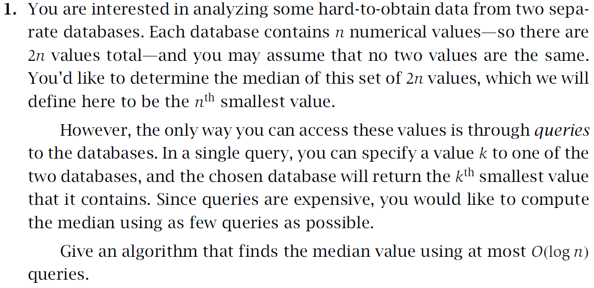
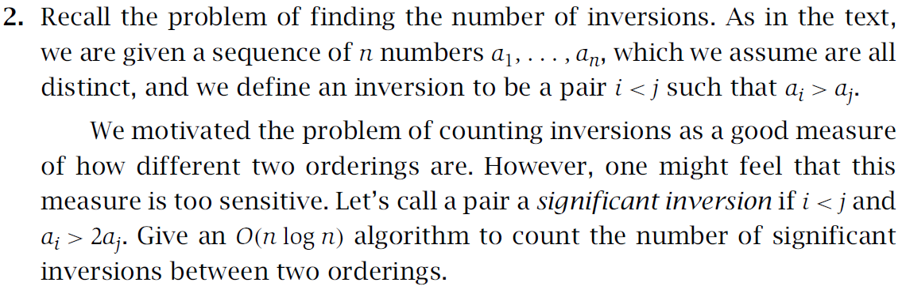
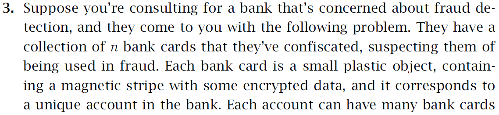
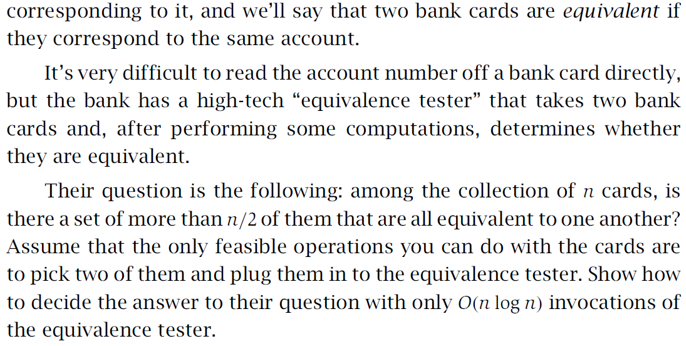
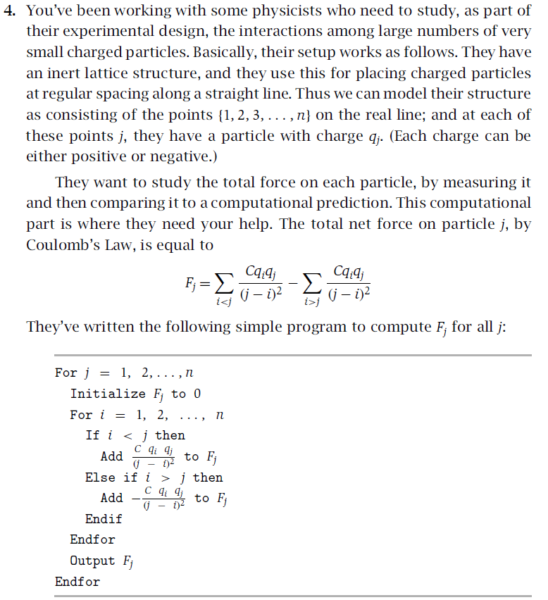
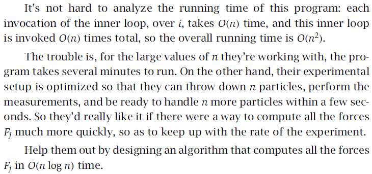
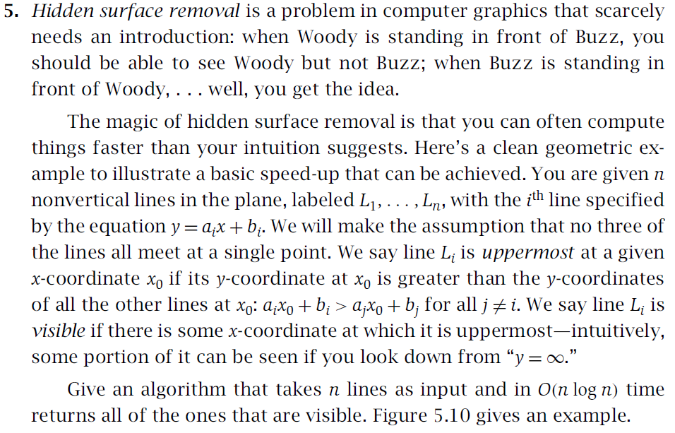
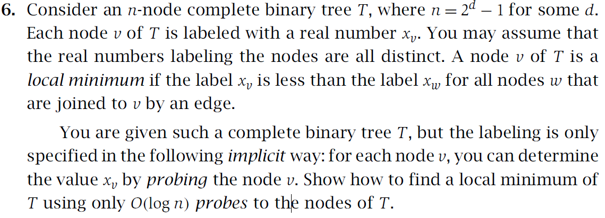
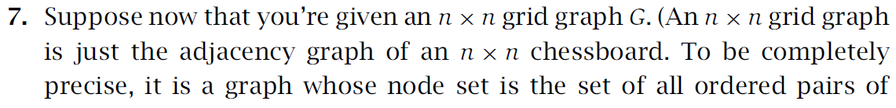
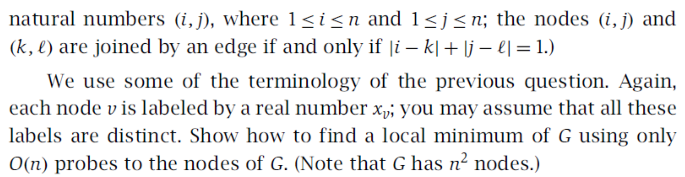

# Assignment 3

#### id: 519021910861
#### name: huidong xu
------
```date: 2021-10-25```

### 5-1


要实现 $O(log(N))$ 的时间复杂度，应该使用分治法，将数据分成两份来使用并丢弃其中一份，递归这个过程直到找到答案。本题中，我们每次都在两个数据库中比较有效剩余数据，并以此为依据丢弃一半的数据，具体伪代码如下。

```c++
ptr_A_L, ptr_A_R <- 0, n - 1
ptr_B_L, ptr_B_R <- 0, n - 1

for i = 1 : log(n) /* 每次丢弃一半数据 */
	ptr_A_M <- (ptr_A_L + ptr_A_R) / 2
	ptr_B_M <- (ptr_B_L + ptr_B_R) / 2
	val_A <- query_database_A(ptr_A_M)
	val_B <- query_database_B(ptr_B_M)
	if val_A <= val_B : 
		ptr_A_L <- ptr_A_M
		ptr_B_R <- ptr_B_M
	else :
		ptr_A_R <- ptr_A_M
		ptr_B_L <- ptr_B_M

result <- min(query_database_A(ptr_A_M), query_database_B(ptr_B_M)) 
```

### 5-2


显著的逆序仅仅将逆序的标准严格化了，所以只需要在基于归并排序的逆序计数算法中修改计数条件即可，具体算法伪代码如下。

```C++

int mergeAndCount(arr[], start, end):
	if start >= mid : return 0
	
	/* 分治法应用 */
	mid <- (start + end) / 2
	ans <- mergeAndCount(start, mid) + mergeAndCount(mid + 1, end)
	
	/* 计数 */
	ptr_L, ptr_R <- start, mid + 1
	while ptr_L <= mid & ptr_R <= end :
		while ptr_R <= end & arr[ptr_L] > 2 * arr[ptr_R] : 
			ans <- ans + ptr_R - (mid + 1)
			ptr_R <- ptr_R + 1
		ptr_L <- ptr_L + 1
	/* 将剩余的计数完成 */
	ans <- ans + (mid - ptr_L + 1) * (ptr_R - (mid + 1))
	
    /* 进行归并 */
    new_arr
    ptr_L, ptr_R <-  start, mid + 1
    while ptr_L <= mid & ptr_R <= end :
    	if ptr_L < ptr_R :
    		new_arr.append(arr[ptr_L])
    		ptr_L <- ptr_L + 1
    	else :
    		new_arr.append(arr[ptr_R])
    		ptr_R <- ptr_R + 1
    while ptr_L <= mid :
    	new_arr.append(arr[ptr_L])
    	ptr_L <- ptr_L + 1
    while ptr_R <= end:
    	new_arr.append(arr[ptr_R])
    	ptr_R <- ptr_R + 1
    /* 将排序过的部分数组赋给原数组 */
    arr[start] ... arr[end] <- new_arr
    
    return ans
```

### 5-3


因为题目规定要使用时间复杂度为 $O(nlogn)$ 的算法，所以我们从分治法下手。我们对银行卡进行一个从 0 到 n - 1 的编号，每次取出有效范围内的中位数，并将其往前后对比找出分割子数组的界限，从而将其划分成两个子问题计算。具体算法伪代码如下。

```C++
maxCnt <- 0 /* 最大出现次数 */
idx <- -1 /* 可能为众数的元素下标 */

bool splitAndCount(arr[]):
	if arr.empty() : return
	
	left, right <- 0, arr.size() - 1	
	mid <- (left + right) / 2
	cnt <- 0
	left_arr[], right_arr[]
    
	for i = left : mid
		if arr[i] == arr[mid] : cnt <- cnt + 1
        else : left_arr.append(arr[i])
    for i = mid + 1 : right
    	if arr[i] == arr[mid] : cnt <- cnt + 1
    	else : right_arr.append(arr[i])
    
    if cnt > maxCnt :
    	maxCnt = cnt
    	idx = mid
    if left_arr.size() > maxCnt :
    	splitAndCount(left_arr)
    if right_arr.size() > maxCnt :
    	splitAndCount(right_arr)
   	/* 查看最大出现元素此次数是否超过一半 */
   	return maxCnt > arr.size() / 2
```

* 使用摩尔投票算法可以将这道题的时间复杂度优化到 $O(n)$。

### 5-4


这道题可以直接使用卷积来计算。我们定义两个 $vector$，分别是：
$$
a = (q_1, q_2, ..., q_n)
$$
$$
b = (n^{-2}, (n - 1)^{-2}, ..., \frac{1}{4}, 1, 0, -1, \frac{-1}{4}, ... -n^{-2})
$$
所以，对于每个 $j$，$a$ 和 $b$ 的卷积就会有如下的形式。
$$
\sum_{i < j}\frac{q_i}{(j - i)^2} + \sum_{i > j}\frac{-q_i}{(j - i )^2}
$$
我们将 $Cq_j$ 乘以上式即可得到受力 $F_j$。
又因为卷积可以在 $O(nlogn)$ 时间内计算完成，重新组成 $F_j$ 花费额外的 $O(n)$ 时间，所以总的时间复杂度为 $O(nlog(n))$。

### 5-5


我们先将所有线段按斜率递增进行标记，然后再使用分治法。$n \le 3$ 是最基本的情况，我们可以在常数时间内找出可见线段：第 1 条线（斜率最小的）和第 3 条线（斜率最大的）必然可见，第 2 、1 条线的交点如果在第 2 、3 条线的交点左侧则第 2 条线可见，否则不可见。

我们首先将整个数组按照线段斜率升序排序。然后利用分治法，取中位数将数组分成两边，分别求解可见线段并返回，一直分解数组直到满足上述基本情况。而怎么将两个数组进行合并就成了关键！

在合并过程中，我们需要用到分治后数组的线交点，这就要求我们在分治过程中也不断求取两条斜率相邻线段的交点并返回。有了线交点，我们可以对左右两个子数组返回的线交点进行按 x 坐标递增的归并排序，这一步时间复杂度为 $O(N)$ 符合要求。然后对于每条线，我们找到其对应的交点在上述按 x 坐标排序后数组中的位置（可以使用一个哈希表来做映射，时间复杂度降为 $O(1)$ ），于是就可以找到其相邻的两条相交线段，这时我们便可以回到基本情况来判断这条线段是否可见。因为左右子数组返回的可能可见线段之和不超过 N ，所以这一步时间复杂度为 $ (N) $ 。

综上，我们利用分支法来求解该问题，在每一步合并两种子情况时时间复杂度不超过 $O(N)$ ，所以整个算法时间复杂度即为 $O(NlogN) $ 。

### 5-6


我们首先比较根结点的标记值和它的两个子节点（如果有），如果根结点的值最小则返回根结点，否则以任意一个比根结点小的子节点作为根结点继续上述过程。直到比较遇到上述情况，或者该节点两个子节点均为空时返回该子节点，此时该节点必然比其父节点小（不然在上一步就不会选择它），即是局部最小值。

不难看出，我们每一步只需要最多进行 3 次节点值探测，而做多 d（即 $logN$ ) 步就可以完成该算法，因此算法复杂度是 $O(logN)$ 。

### 5-7



我们首先找出所有边界点的最小值，并查看其周围值，如果它是最小则它就是局部最小值。如果它旁边（不在边界处的）点值比它小，否则我们将矩阵按照中心对称划分成 4 块，取划分行和划分列以及他们相邻上下左右共 4 行（列），再利用 $O(N)$ 时间查找这其中的最小值，如果这个最小值在划分行 / 划分列中，则其就是局部最小值，否则我们对包含该最小值点所在的块重复上述过程。

不难看出，我们每次都将原问题分成 4 个小问题并选取其中一个小问题进行求解，有递推关系式：
$$
T(N) = O(N) + T(N / 2)
$$
根据主定理，我们可知该算法时间复杂度为 $O(N)$ 。

