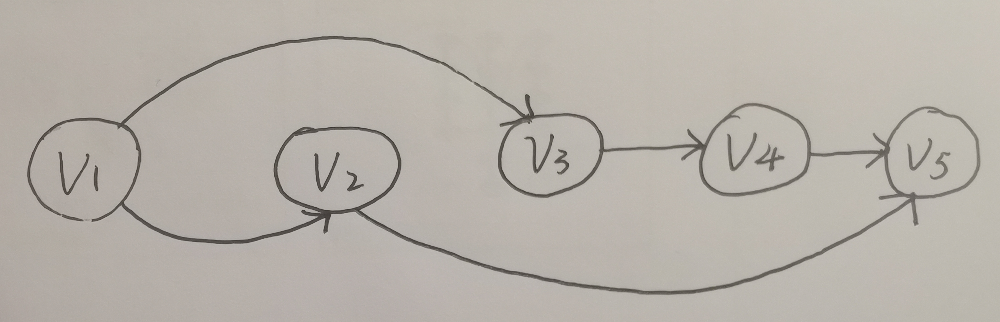

# Assignment 4

#### id: 519021910861
#### name: huidong xu
------
```date: 2021-11-6```

### 6-1
(a) 1 -> 8 -> 9 -> 8 -> 1
使用最大权重优先贪婪算法会选择 1 + 9 + 1 = 11，而最优解应该是 8 + 8 = 16。
(b) 1 -> 8 -> 1 -> 1 -> 8
使用奇偶集合法会选择奇数集合 1 + 1 + 8 = 10，而最优解应该是 8 + 8 = 16。
(c) 使用动态规划，递推式如下，假设数组为 1-base ：
$$
d[i] = 
\begin{cases}
w[i]\ &i\ =\ 1, 2\\
max(d[i - 1], d[i - 2] + w[i])\ &i\ =\ 3, 4, 5, ...\\
\end{cases}
$$
相当于每次都比较选择当前元素（不选择上个元素）和不选择当前元素的最大值。

### 6-2
(a) 反例就是两个大任务的薪资都很高，且后面那个更高很多。
| | week1 | week2 | week3 | week4 | 
| :--: | :--: | :--: | :--: | :--: |
| l | 2 | 2 | 2 | 2 | 
| h | 1 | 50 | 5000 | 1 |

根据算法我们将会选择 2 + 50 + 2 + 2 = 56，然而最优解应该是 2 + 0 + 5000 + 2 = 5004。
(b) 我们使用动态规划来进行计算，假设数组下标是 1-base，递推式是：
$$
d[i][j] = 
\begin{cases}
0   & i = 1,\ j = 1\\
l[1] & i = 1,\ j = 2\\
h[1] & i = 1,\ j = 3\\
max(d[i - 1][1], dp[i - 1][2], dp[i - 1][3]) & i = 2, 3, ...\ j = 1\\
max(d[i - 1][1], dp[i - 1][2], dp[i - 1][3]) + l[i] & i = 2, 3, ...\ j = 2\\
dp[i - 1][1] + h[i] & i = 2, 3, ...\ j = 3\\
\end{cases}
$$
相当于用 $j$ 来表示这周工作性质，$j = 0, 1, 2$ 分别代表这周不干活、干小活和干大活，根据其对上周干活的要求写出递推关系式，编程用数组实现即可。

### 6-3
(a) 如下图：错误的算法会得到 $(v_1, v_2)$ 和 $(v_2, v_5)$ 两条边，而正确答案是 $(v_1, v_3)$，$(v_3, v_4)$，$(v_4, v_5)$ 三条边。

(b) 应用动态规划，假设数组是 1-base，得到递推式为：
$$
d[i] = 
\begin{cases}
0 & i = 1\\
max(d[i], d[j] + 1) & i = 2, 3, ...\ and\ j = i - 1, i - 2, ...\ and\ there\ is\ an\ directed\ edge\ between\ i\ and\ j\\ 
\end{cases}
$$
为了更好解释递推式，伪代码如下：
```C++
d[n + 1] <- 0 /* 初始化数组全为 0 */
flag[n + 1] <- false /* 用于记录是否能够与 v1 连通 */
d[1] <- 0 , flag[1] <- true
for i = 2 to n:
	for j = i - 1 to 1:
		if (vi, vj) exist && flag[j]:
			d[i] <- max(d[i], d[j] + 1);
			flag[i] <- true
return d[n]
```
### 6-11
应用动态规划来解决，递推式如下，假设我们用 1-base :
为防止越界，初始化：
$$
d[0][1] = d[0][2] = d[0][3] = d[0][4] = d[0][5] = 0;
$$
$$
d[i][j] = 
\begin{cases}
min(d[i - 1][4], d[i - 1][5]) + 4 * c & j = 1\\
d[i - 1][1] & j = 2\\
d[i - 1][2] & j = 3\\
d[i - 1][3] & j = 4\\
min(d[i - 1][4], d[i - 1][5]) + r * s[i] & j = 5\\
\end{cases}
$$
即我们用 $j$ 维度来表示第 $i$ 天的状态，$j = 1, 2, 3, 4$ 分别代表该天是连续 B 公司的第几天，而 $j = 5$ 则代表该天选择 A 公司。

### 6-12
我们逆序地应用动态规划来解决这个问题，通过从最后一台服务器开始，依次往前遍历，每次计算这台服务器的最小开销，伪代码如下：
```c++
/* i 代表第几个服务器，j 代表是否放置副本
/* j = 1 为不放置，j = 2 为放置 */
d[n + 1][2] <- INT_MAX

d[n][1] <- INT_MAX /* 第 n 个服务器必须放置 */
d[n][2] <- Cn

for i = n - 1 to 1:
	d[i][2] = Ci + min(d[i + 1][1], d[i + 1][2]) /* 第 i 台服务器放置副本，放置开销和之前服务器的总开销 */
	for j = i + 1 to n:
		tot <- 0
		for k = j - 1 to i + 1:
			tot += min(d[k][1] + j - k, d[k][2])
		d[i][1] = min(d[i][1], d[j][2] + (j - i) + tot) /* 第 i 台服务器不放置副本，访问开销 */
return min(d[1][1], d[1][2])
```

### 6-13
我们使用动态规划来解决此题，$d[i]$ 代表我们能从第 1 家公司最多换到的第 $i$ 家公司的股票值。
```c++
d[n + 1] <- 0
d[1] <- 1 /* 初始化 */
for i = 2 to n:
	for j = i - 1 to 1:
		d[i] = max(d[i], d[j] * r_ij)
/* 用第 i 家公司的股票换回第 1 家公司股票 */
ans <- -1
for i = 1 to n:
	ans = max(ans, d[i] * r_i1)
return ans;
```