# hands-on-3
#### id: 519021910861
#### name: huidong xu
------

**Q1. What's the role of DNS?**

The domain name system(DNS) is a naming database in which Internet domain names are located and translated into Internet Protocol(IP) addresses. DNS maps the name people use to locate a website to the IP address that a computer uses to locate that website.

For example, if someone types "ipads.se.sjtu.edu.cn" into a web browser, a server behind the scenes maps that name to the corresponding IP address 202.120.40.85 which I get from a `dig`.

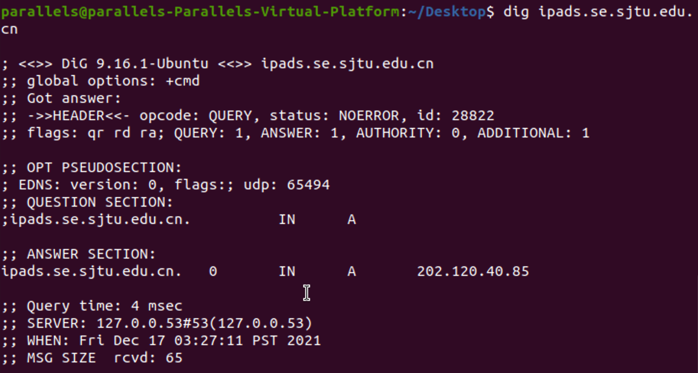

What's more, web browsing and most other Internet activities rely on DNS to quickly provide the information necessary to connect users to remote hosts. DNS mapping is distributed throughout the Internet in a hierarchy of authority. Access providers and enterprises, as well as governments, universities and other organizations, typically have their own assigned ranges of IP addresses and an assigned domain name. They also typically run DNS servers to manage the mapping of those names to those addresses. Most Uniform Resource Locators(URLs) are built around the domain name of the web server that takes client requests.

**Q2. How can you ask a specific DNS server(instead of the default) for information about a domain name? For example, once the default server crashes and you wish to ask the other server 8.8.8.8, what command should you use?**

Use dig with specific command.

```
> dig @8.8.8.8 ipads.se.sjtu.edu.cn +norecurse
```

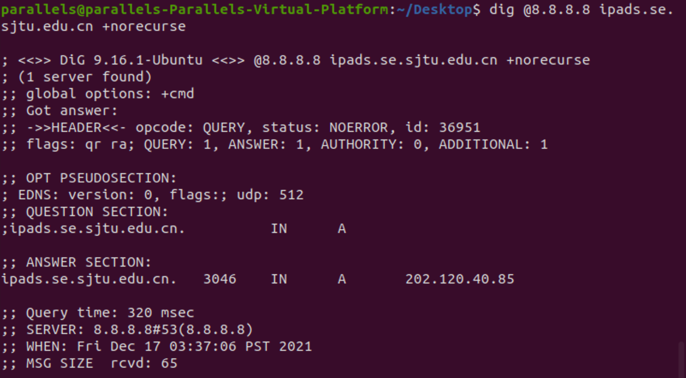

Use nslookup with specific command.

```
> nslookup ipads.se.sjtu.edu.cn 8.8.8.8
```

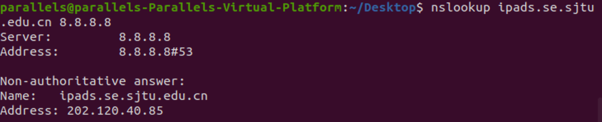

**Q3. Do you know the process of solving the domain name of "ipads.se.sjtu.edu.cn"? How many queries did it take to find the IP address for ipads? Include the sequence of commands that you used.**

There will be **5** queries.
1. Look up the root server, and get response address 'cn.'
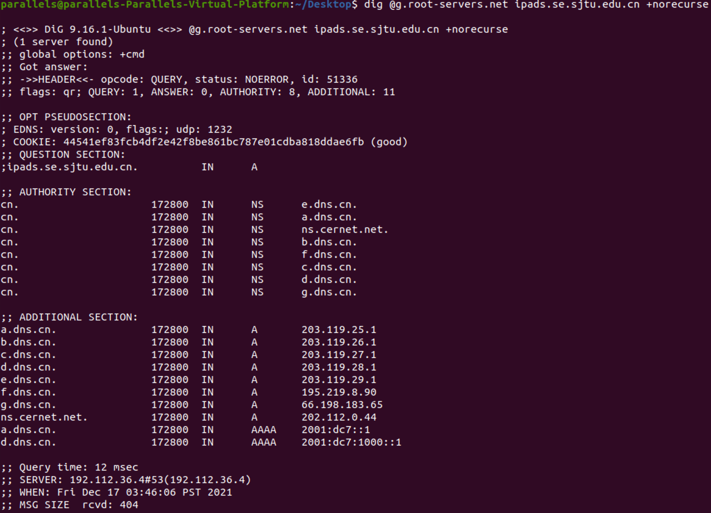

2. Ask '.cn' server, and get response address 'edu.cn.'
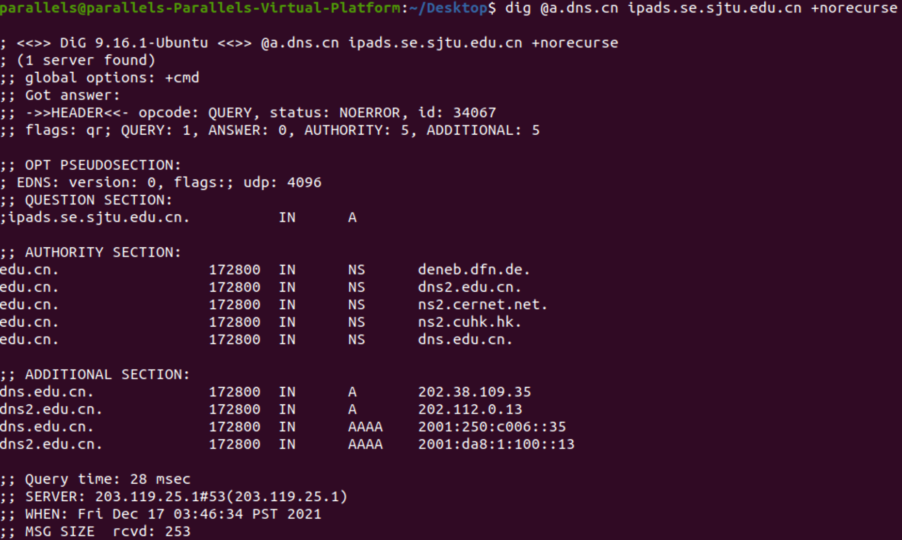

3. Ask 'edu.cn.' server, and get response address 'sjtu.edu.cn'
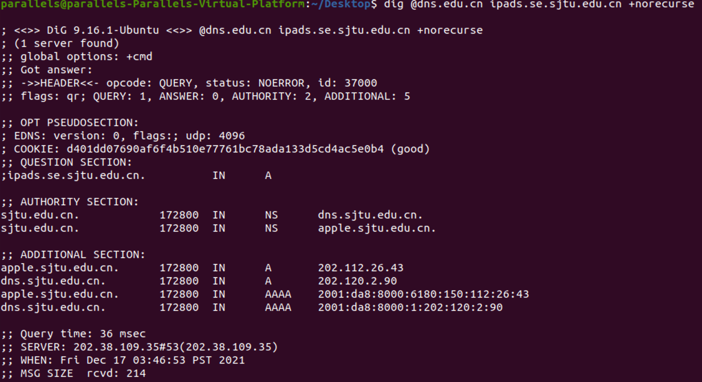

4. Ask 'sjtu.edu.cn.' server, and get response address 'se.sjtu.edu.cn'
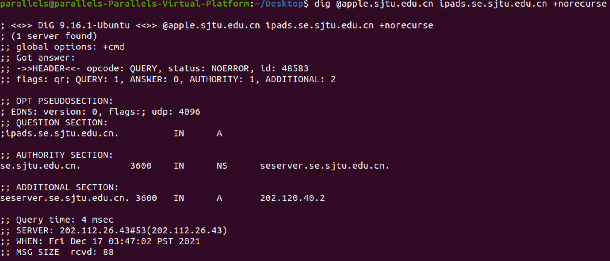

5. Ask 'se.sjtu.edu.cn.' server, and get response address 'ipads.se.sjtu.edu.cn'
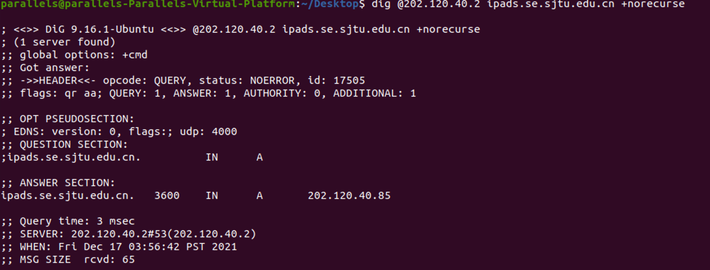

**Q4. Did the default server have the answer in its cache? How do you know?**
If it is obtained from the cache, it can be seen from the result of dig. There is a Time To Live(TTL), which is the number after `ipads.se.sjtu.edu.cn` in the picture. It can be seen that the same website is visited twice before and after, and the TTL has changed from 238 to 233. If it exceeds when no one visits at this time, it will be removed from the DNS cache.

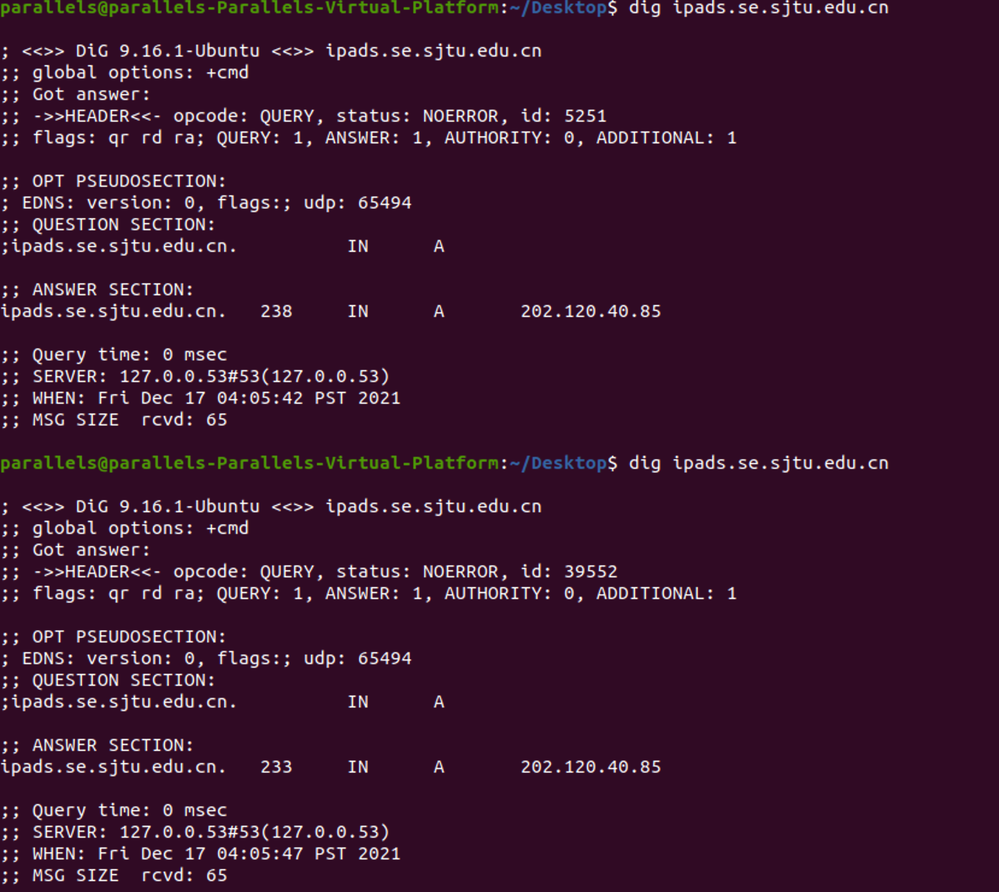

I got verification from a website that is unlikely to have ever been visited.
When I visit `xhd.cn` for the first time, I can see that the TTL is 600 and the Query Time is very long because the URL does not exist and is not cached in dig.

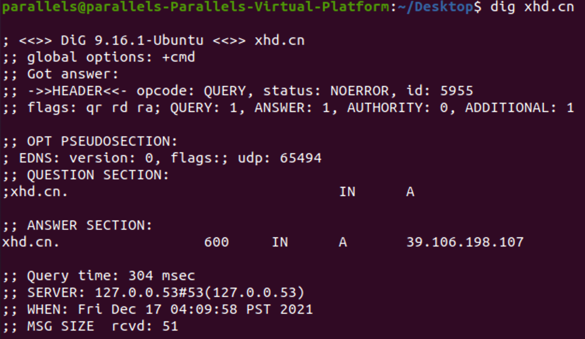

When I visited again, because dig was already cached, the Query Time was very short, and the TTL was correspondingly substract from the interval between these two visits.

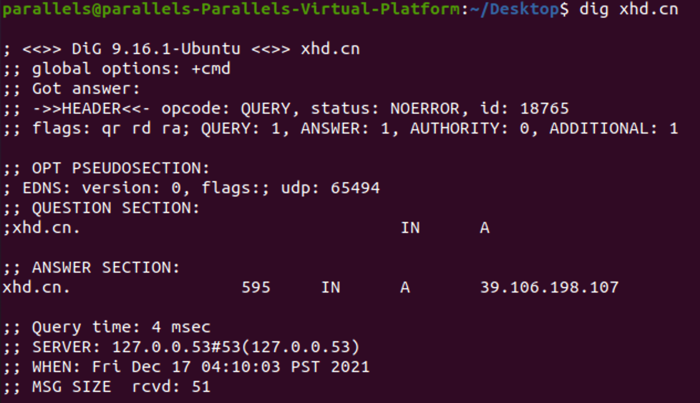

