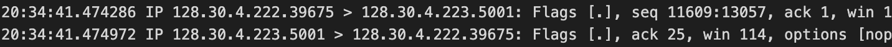
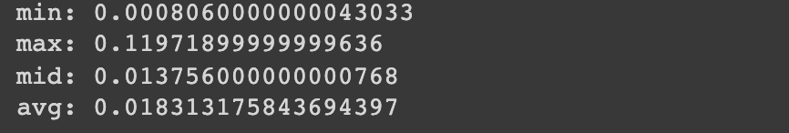

# hands-on-4
#### id: 519021910861
#### name: huidong xu
------

运行：`tcpdump -r tcpdump.dat > outfile.txt`

**What are the IP addresses and TCP ports of BingBing and DongDong?**


根据 'seq' 和 'ack' 可以分辨出两个 server：

DongDong
IP: 128.30.4.222
port: 39675

BingBing
IP: 128.30.4.223
port: 5001

**How many KB were transferred during this TCP session and how long did it last? **

可以看出第一条 'ack' 是从 1 开始：


可以看出最后一条 'seq' 是到 1572889 结束：


所以计算可得：

total KB = 1572889 - 1 bytes = 1572888 bytes = 1572.888 KB
start timestamp: 20:34:41.473036
end timestamp: 20:34:44.339015
how long = end timestamp - start timestamp = 2.865979 s

**What is the throughput (in KB/s) of this TCP flow between DongDong and BingBing?**

throughput = total KB / how long = 1572.888 KB / 2.865979 s = 548.81386 KB /  s

**What is the round-trip time (RTT) between DongDong and BingBing?**
经过 [python](./cse-hands-on-4.ipynb) 脚本，得到结果为：


具体 python 代码为，在 Google 的 Colab 上运行：

```python
from google.colab import drive
drive.mount('/content/drive')

import os

file = open("/content/drive/MyDrive/cse-hands-on-4/outfile.txt", "r")
lines = file.readlines()

DongDong_list = []
BingBing_list = []
i = 0
for line in lines:
  i += 1
  if (i <= 4): pass
  elif (str(line).find("seq") != -1): DongDong_list.append(str(line))
  else: BingBing_list.append(str(line))
print("DongDong_list_line\n %s\n" % DongDong_list[5])
print("BingBing_list_line\n %s\n" % BingBing_list[6])

DongDong_map = {}
i = 0
for line in DongDong_list:
  i += 1

  start_idx = line.find(", seq")
  if start_idx == -1: continue
  else:
    start_idx = line.find(":", start_idx) + 1
    end_idx = line.find(",", start_idx)
    key = line[start_idx : end_idx]
    value = float(line[line.find(":", 3) + 1 : line.find(" ")])
    DongDong_map[key] = value
    if (i <= 3):
      print("Insert DongDong_map: <key, value> = <%s, %s>\n" % (str(key), str(value)))

BingBing_map = {}
i = 0;
for line in BingBing_list:
  i += 1
  
  start_idx = line.find(", ack")
  if start_idx == -1: continue
  else:
    start_idx += 6
    end_idx = line.find(",", start_idx)
    key = line[start_idx : end_idx]
    value = float(line[line.find(":", 3) + 1 : line.find(" ")])
    BingBing_map[key] = value
    if (i <= 3):
       print("Insert BingBing_map: <key, value> = <%s, %s>\n" % (str(key), str(value)))
       
import numpy as np

time_list = []
for key, val in DongDong_map.items():
  ack = BingBing_map.get(key, -1)
  if (ack != -1):
    time_list.append(ack - val)
print(time_list)

print("min: %s" % str(min(time_list)))
print("max: %s" % str(max(time_list)))
print("mid: %s" % str(np.median(time_list)))
print("avg: %s" % str(np.mean(time_list)))
```

