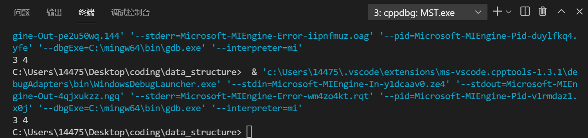

## MST
###### id: 519021910861
###### name: 徐惠东
1. 代码
```C++
vector<int> findRedundantConnection(vector<vector<int>> &edges) {
    // your implementation
    /* 用邻接表存放边 */
    const int n = edges.size();
    vector<vector<int>> table(n + 1);
    for (int i = 0; i < n; i++)
    {
        table[edges[i][0]].push_back(edges[i][1]);
        table[edges[i][1]].push_back(edges[i][0]);
    }
    /* Prim算法判断，用两个集合表示已经加入的点和还未加入的点 */
    set<int> S, U;
    vector<int> ans;
    typedef struct edge
    {
        /* data */
        int x;
        int y;
        edge(int xx, int yy) : x(xx), y(yy) {};
    } edge_t;
    vector<edge_t> K; // 存放待选择的边
    for (int i = 1; i <= n; i++) U.insert(i);
    /* 随便选取一个点作为起点 */
    U.erase(1); S.insert(1);
    auto iter = table[1].begin();
    while (iter != table[1].end()) { // 将这个点相邻的边全部加入待选择边数组K中
        K.push_back(edge(1, *iter));
        ++iter;
    };
    while (!S.empty()) {
        edge cur = K.back();
        K.pop_back();

        if (S.find(cur.x) != S.end() && S.find(cur.y) != S.end()) {
            /* 寻找结果数组，防止输出反了 */
            for (int i = 0; i < n; i++) {
                if (edges[i][0] == cur.x && edges[i][1] == cur.y) {
                    ans.push_back(cur.x);
                    ans.push_back(cur.y);
                    break;
                } else if (edges[i][1] == cur.x && edges[i][0] == cur.y) {
                    ans.push_back(cur.y);
                    ans.push_back(cur.x);
                    break;
                }
            };
            return ans;
        } else if (S.find(cur.x) == S.end()) {
            U.erase(cur.x); S.insert(cur.x);
            iter = table[cur.x].begin();
            while (iter != table[cur.x].end()) {
                K.push_back(edge(cur.x, *iter));
                ++iter;
            };
        } else if (S.find(cur.y) == S.end()) {
            U.erase(cur.y); S.insert(cur.y);
            iter = table[cur.y].begin();
            while (iter != table[cur.y].end()) {
                K.push_back(edge(cur.y, *iter));
                ++iter;
            };
        } else {
            printf("Error: this is not possible!");
        };
    };
}
```
2. 时间复杂度
	平均情况下时间复杂度为O(n)。
	思想：维护两个点集，S用于保存已经经过一次的点，U用于保存还从未经过的点。维护一个边集K，用于保存还待选择的边，每次从边集中选择一条边，如果这条边中一个顶点在S中另一个顶点在U中，则将这条边从边集中除去，并在S和U中做对应的加入删除操作，并把新加入的点的边加入边集中，如果这条边的两个顶点都在S中，则输出这条边作为最后结果。
	
3. 运行截图

   

