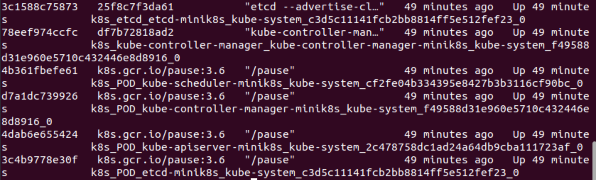
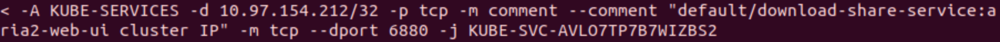
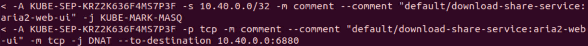

# k8s hw

**name: 徐惠东**
**id: 519021910861**

## 目录

- [目录](#目录)
- [使用kubeadm安装并部署k8s集群](#使用kubeadm安装并部署k8s集群)
- [部署 Pod](#部署 Pod) 
- [部署 Service](#部署 Service)
- [使用 Deployment 为 Pod 创建备份](#使用 Deployment 为 Pod 创建备份)

## 使用kubeadm安装并部署k8s集群

> Q1: 请记录所有安装步骤的指令，并简要描述其含义。

#### 安装 Kubeadm

获取网络接口的 MAC 地址，确保每个节点上 MAC 地址的唯一性。

```bash
$ ifconfig -a
```


对 `product_uuid` 校验，确保虚拟机中每个节点上的 `product_uuid` 的唯一性。

```bash
$ sudo cat /sys/class/dmi/id/product_uuid
```


确保 `br_netfilter` 模块被加载。

```bash
$ sudo modprobe br_netfilter # 显示加载 br_netfilter 模块
$ lsmod | grep br_netfilter
```


允许 `iptables` 检查桥接流量。


安装 `kubeadm`，`kubelet` 和 `kubectl`。

```bash
$ sudo curl -fsSLo /usr/share/keyrings/kubernetes-archive-keyring.gpg https://mirrors.aliyun.com/kubernetes/apt/doc/apt-key.gpg
$ echo "deb [signed-by=/usr/share/keyrings/kubernetes-archive-keyring.gpg] https://mirrors.aliyun.com/kubernetes/apt/ kubernetes-xenial main" | sudo tee /etc/apt/sources.list.d/kubernetes.list 
$ sudo apt-get update
$ sudo apt-get install -y kubelet kubeadm kubectl
$ sudo apt-mark hold kubelet kubeadm kubectl
```

#### 安装 Docker

安装 `docker` 环境。老老实实参照 [Install Docker Engine on Ubuntu](https://docs.docker.com/engine/install/ubuntu/) 安装，别搞那些 `sudo apt-get install docker` 和 `pip install docker`，不然要出幺蛾子。

```bash
# 一定要切换到普通用户，否则 docker 可能出问题
$ sudo adduser k8s-hw-1 
$ usermod -aG sudo k8s-hw-1 # 将普通用户添加到 sudo 用户组
$ su k8s-hw-1 # 切换到普通用户
$ sudo groupadd docker
$ sudo usermod -aG docker $USER
$ newgrp docker
$ docker run hello-world # 验证你可以不用在 sudo 的形势下跑 docker
```

```bash
$ sudo apt-get remove docker docker-engine docker.io containerd runc # 移除旧的 docker 包
$ sudo apt-get update
$ sudo apt-get install \ # 更新 apt 包
	ca-certificates \
	curl \
	gnupg \
	lsb-release
$ curl -fsSL https://download.docker.com/linux/ubuntu/gpg | sudo gpg --dearmor -o /usr/share/keyrings/docker-archive-keyring.gpg # 下载密钥
$ echo "deb [arch=$(dpkg --print-architecture) signed-by=/usr/share/keyrings/docker-archive-keyring.gpg] http://mirrors.aliyun.com/docker-ce/linux/ubuntu $(lsb_release -cs) stable" | sudo tee /etc/apt/sources.list.d/docker.list > /dev/null # 使用阿里云镜像
$ sudo apt-get update
$ sudo apt-get install docker-ce docker-ce-cli containerd.io docker-compose-plugin
$ apt-cache madison docker-ce
$ sudo apt-get install docker-ce=<VERSION_STRING> docker-ce-cli=<VERSION_STRING> containerd.io docker-compose-plugin
$ docker run hello-world # 实验一下 docker 是否起来了
```

#### 安装 minikube

根据 [在 Linux 安装 ExpressVPN](https://www.expressvpn.com/support/vpn-setup/app-for-linux/#install) 安装 `expressvpn`，并连通 vpn 不然等会拉去镜像好慢还容易失败。

根据 [Install Minikube](https://k8s-docs.netlify.app/en/docs/tasks/tools/install-minikube/) 安装 `minikube`，很惨，这个东西没有的话，竟然会波及到后面的 `miniadm` 的运行。

```bash
$ sudo curl -Lo minikube https://storage.googleapis.com/minikube/releases/latest/minikube-linux-amd64 
$ sudo chmod +x minikube
$ sudo mkdir -p /usr/local/bin/
$ sudo install minikube /usr/local/bin/ # 把 minikube 安装到本地路径
$ minikube start --image-mirror-country=cn 
					# 不要使用中国镜像，出问题，还是得用 VPN
          # registry.cn-hangzhou.aliyuncs.com # 阿里云仓库
          # mirror.ccs.tencentyun.com # 腾讯云
          # 05f073ad3c0010ea0f4bc00b7105ec20.mirror.swr.myhuaweicloud.com # 华为云
          # registry.docker-cn.com # docker 中国
          # hub-mirror.c.163.com # 网易

```

#### 部署 Kubernetes 集群

配置 `kubelet` 的 `cgroup` 驱动。

```yaml
# kubeadm-config.yaml
kind: ClusterConfiguration
apiVersion: kubeadm.k8s.io/v1beta3
kubernetesVersion: v1.23.6
---
kind: KubeletConfiguration
apiVersion: kubelet.config.k8s.io/v1beta1
cgroupDriver: cgroupfs
```

将上述配置文件传递给 `kubeadm` 命令：

```bash
$ kubeadm reset # 清空所有设置
$ kubeadm init --config kubeadm-config.yaml
```

将自己注册为一个普通用户。

```bash
$ mkdir -p $HOME/.kube
$ sudo cp -i /etc/kubernetes/admin.conf $HOME/.kube/config
$ sudo chown $(id -u):$(id -g) $HOME/.kube/config
```

使用 `weave` 作为 Pod 网络插件。

```bash
$ kubectl apply -f "https://cloud.weave.works/k8s/net?k8s-version=$(kubectl version | base64 | tr -d '\n')"
```


为了能让两台主机的网络互通，我们需要根据 [配置安全组](https://jcloud.sjtu.edu.cn/document/detail.html?id=890) 来允许所有的 tcp 流量进入。具体地，我添加了如下两条规则，具体的 ip 地址需要根据自己的虚拟机内网 ip 进行设置，并且在虚拟机对应的 **配置安全组** 做相应修改。


将从节点加入集群中，复制 join 语句的时候，因为两台虚拟机是相互隔离的所以没办法 `ctrl+c` 和 `ctrl+v` 进行，所以我用的是使用 **交大云盘** 作为互通，每次将指令写入本地文件并上传，再从另外一台虚拟机下载文件并运行指令。

```bash
$ kubeadm join --token <token> <control-plane-host>:<control-plane-port> --discovery-token-ca-cert-hash sha256:<hash>
```


然后在主节点 `minik8s` 中查看集群信息。**可以看出，我将 `minik8s` 做为主节点，将 `k8s-hw` 做为从节点。**

```bash
$ kubectl get nodes
```


> Q2: 在两个节点上分别使用 `ps aux | grep kube` 列出所有和 k8s 相关的进程，记录其输出，并简要说明各个进程的作用。 

首先在主节点 `minik8s` 中列出所有和 k8s 相关的进程。

```bash
$ ps aux | grep kube
```


然后在从节点 `k8s-hw` 中列出所有和 k8s 相关的进程。


整理一下，即为以下几个进程。

- `kube-controller-manager`
	
	守护进程，Kubernetes 的控制器管理器。通过 API 服务器监视集群的共享状态，并尝试进行更改以将当前状态转为期望状态。

- `kube-scheduler`
	
	控制面进程，Kubernetes 调度器，负责将 Pods 指派到节点上。
	
- `kube-apiserver`

	Kubernetes API 服务器验证并配置 API 对象的数据，这些对象包括 pods、services、replicationcontrollers 等。API 服务器为 REST 操作提供服务，并为集群的共享状态提供前端，所有其他组件都通过该前端进行交互。

- `kubelet`

	每个 Node 节点上运行的主要 “节点代理”。

- `kube-proxy`

	在每个节点运行的网络代理，反映了每个节点上 Kubernetes API 中定义的服务，并且可以执行简单的 TCP、UDP 和 SCTP 流转发，或者在一组后端进行循环 TCP、UDP 和 SCTP 转发。

- `kube-utils`

	weave 的 Pod 网络插件，用于部署节点网络到集群中。

> Q3: 在两个节点中分别使用 `docker ps` 显示所有正常运行的 docker 容器，记录其输出，并简要说明各个容器所包含的 k8s 组件，以及那些 k8s 组件未运行在容器中。

在主节点 `minik8s` 中显示所有正常运行的 docker 容器。

```bash
$ docker ps -a
```




在从节点 `k8s-hw` 中显示所有正常运行的 docker 容器。


简要归纳，可以通过看 `STATUS` 来判断容器中运行的组件，比如 `STATUS` 中含有 `coredns` 的就运行有 CoreDNS 这个可扩展的 DNS 服务器，而含有 `kube_proxy` 、`kube_apiserver`、`kube_scheduler`、`kube_controller` 的就对应运行有上述的组件。

特殊的，含有 `pause` 的运行有 pause 容器，主要为每个业务容器有关于网络命名空间、网络管理、通信等功能。含有 `etcd` 的则运行有 etcd 组件，负责保证分布式系统中的数据一致性。而含有 `weave` 的则运行有网络插件 weave。

目前还没发现哪个 k8s 组件不运行在容器 docker 中的。

## 部署 Pod

> Q4: 请采用声明式接口对 Pod 进行部署，并将部署所需的 yaml 文件记录在实践文档中。

在 master 节点 `minik8s` 中用 yaml 文件部署两个镜像，注意定义标签，不然后面部署 Service 将无法匹配相应的 Pod。

```yaml
kind: Pod
metadata:
	name: download-share
	labels:
		app: nginx-aria2
spec:
	containers:
		- name: nginx
			image: dplsming/nginx-fileserver:1.0
			ports:
				- containerPort: 80
			volumeMounts:
				- name: share-volume
					mountPath: /usr/share/nginx/html/files
		- name: aria2
			image: dplsming/aria2ng-downloader:1.0
			ports:
				- containerPort: 6800
				- containerPOrt: 6880
			volumeMounts:
				- name: share-volume
					mountPath: /data
	volumes:
		- name: share-volume
			hostPath:
				path: /root/k8s-hw
				type: DirectoryOrCreate
```

然后创建这个 Pod 并查看运行状态。

```bash
$ kubectl apply -f ./download_and_share.yaml
$ kubectl get pod
```


> Q5: 请在 worker 节点上，在部署 Pod 的前后分别采用 `docker ps` 查看所有运行中的容器并对比两者的区别。请将创建该 Pod 所创建的全部新容器列举出来，并一一解释其作用。

在普通节点 `k8s-hw` 查看新运行的容器，主要增加了如下图的三个容器（pause 容器应该是会随着容器创建而自动创建的，在这里我们不作为主要考虑因素）。

```bash
$ docker ps -a
```


可以看出，有一个容器用于运行 nginx-fileserver，有一个容器用于运行 aria2ng-downloader，而还有一个容器则用来维持整个 Pod。

> Q6: 请结合博客 https://blog.51cto.com/u_15069443/4043930 的内容，将容器中的 veth 与 host 机器上的 veth 匹配起来，并采用 ip link 和 ip addr 指令找到位于 host 机器中的所有网络设备及其之间的关系。结合两者的输出，试绘制出 worker 节点中涉及新部署 Pod 的所有网络设备和其网络结构，并在图中标注出从 master 节点中使 cluster ip 访问位于 worker 节点中的 Pod 的网络路径

我们在 worker 节点的 `aria2` 容器中查看与它配对的 `veth` 的 `index` 是 $18$

```bash
$ docker exec -it 3d32ee81f3ab bash # 进入对应容器
$ ip link show eth0 # 在容器中执行命令
```


同理对于 worker 节点的 `nginx` 容器，我们进入容器查看与它配对的 `veth` 的 `index`  也是 $18$。

```bash
$ docker exec -it bbf39b3d023e bash # 进入对应容器
$ apt-get update & apt-get install -y iproute2 # 在这个容器里安装 ip 工具
$ ip link show eth0 # 在容器中执行命令
```


然后再在主机中查看对应 $18$ 的 `vethinterface` ，发现是 `vethweplc3dc72e`。

```bash
$ ip link show | grep 117
```


涉及到 worker 节点中新部署的 Pod 的网络拓扑如下，橙色线条标注了从 master 节点中使用ClusterIP 访问位于 worker 节点中的 Pod 的网络路径。


## 部署 Service

> Q7: 请采用声明式接口对 Service 进行部署，并将部署所需的 yaml 文件记录在实践文档中。

注意，我们的 Service 相当于是在 Pod 上的更高层级抽象，所以之前部署的 Pod 不用停止。

然后，我们创建新的 `yaml` 文件来自动化部署 Service，注意定义 `selector` 来管理对应 `label`  的 Pod。

```yaml
apiVersion: v1
kind: Service
metadata:
	name: download-share-service
spec:
	selector:
		app: nginx-aria2
	ports:
		- port: 80
			targetPort: 80
			name: nginx
		- port: 6800
			targetPort: 6800
			name: aria2-rpc
		- port: 6880
			targetPort: 6880
			name: aria2-web-ui
```

然后在 master 节点执行命令来部署 Service 并验证是否部署成功。

```bash
$ kubectl apply -f download_and_share_service.yaml # 部署 Service
$ kubectl get service # 验证 Service
```


进一步验证 Service 是否部署成功，可以看到对应的 `Endpoints` 有了相应的 `ip` 和 `port`。

```bash
$ kubectl describe svc download-share-service
```


进一步地，我们验证 `Endpoints` 中的 `ip` 和 `port` 是否能够连通。

```bash
$ curl 10.40.0.0:80
$ curl 10.40.0.0:6880
$ curl 10.40.0.0:6800
```


> Q8: 请在 master 节点中使用 `iptables-save` 指令输出所有的 iptables 规则，将其中与 Service 访问相关的 iptable 规则记录在实践文档中，并解释网络流量是如何采用基于 iptables 的方式被从对 Service 的 cluster IP 的访问定向到实际的 Pod 中。

我们现在来查看 `iptables` 的规则，因为实在是太多了，所以我用了一个巧妙的方式来查看增加的规则们。在 master 节点主机上运行下面的命令。

```bash
$ iptables-save > ip-before.txt # 在部署 Service 之前
...
$ iptables-save > ip.txt # 在部署 Service 之后
$ diff ip.txt ip-before.txt > diff.txt # 对比两个文件的不同点并保存在 diff.txt 文件中查看
```

我参考了 [这篇博客](https://www.cnblogs.com/charlieroro/p/9588019.html) 来理解 iptables，即 node 节点的 iptables 是由 kube-proxy 生成的，kube-proxy 只修改了 filter 和 nat 表，它对 iptables 的链进行了扩充，自定义了 `KUBE-SERVICES`，`KUBE-NODEPORTS`，`KUBE-POSTROUTING`，`KUBE-MARK-MASQ` 和 `KUBE-MARK-DROP` 五个链，并主要通过为 `KUBE-SERVICES` 链增加规则来配置 traffic routing 规则。


我们可以看出，通过 `KUBE-SERVICES` 将服务端口暴露出来，即 `6880`，`80` 和 `6800`，即我们可以通过 `ClusterIP : Port` 的方式访问该服务，并且它还将请求转发到 `KUBE-SVC-` 链上。




首先，我们发现 kube-proxy 对每个服务创建了 `KUBE-SVC-` 链，并在 nat 表中将 `KUBE-SERVICES` 链中每个目标地址是 service 的数据包导入这个 `KUBE-SVC` 链，而 `KUBE-SEP` 表示的是 `KUBE-SVC` 对应的 endpoint，当接收到的 serviceInfo 中包含 endpoint 信息时，为 endpoint 创建跳转规则。


更细致地，例如在 `KUBE-SEP-CEU2EBMCB76V6EJE` 中的处理是：将经过该链的所有 TCP 报文，DNAT 为 container 内部暴露的访问方式为 `10.40.0.0:80`。结合对 `KUBE-SVC` 的处理可知这种访问方式就是 ClusterIP 的访问方式。





总结来说，iptables 的转发规则可以归纳为。


> Q9: kube-proxy 组件在整个 Service 的定义与实现过程中起到了什么作用？请自行查找资料，并解释在 iptables 模式下，kube-proxy 的功能。

参考 [这篇博客](https://www.cnblogs.com/fuyuteng/p/11598768.html#:~:text=kube-proxy%E7%9A%84%E4%BD%9C%E7%94%A8%E4%B8%BB%E8%A6%81%E6%98%AF%E8%B4%9F%E8%B4%A3service%E7%9A%84%E5%AE%9E%E7%8E%B0%EF%BC%8C%E5%85%B7%E4%BD%93%E6%9D%A5%E8%AF%B4%EF%BC%8C%E5%B0%B1%E6%98%AF%E5%AE%9E%E7%8E%B0%E4%BA%86%E5%86%85%E9%83%A8%E4%BB%8Epod%E5%88%B0service%E5%92%8C%E5%A4%96%E9%83%A8%E7%9A%84%E4%BB%8Enode,port%E5%90%91service%E7%9A%84%E8%AE%BF%E9%97%AE%E3%80%82) 和 [这篇博客](https://www.bookstack.cn/read/source-code-reading-notes/kubernetes-kube_proxy_iptables.md#:~:text=kube-proxy%20%E7%BB%84%E4%BB%B6%E8%B4%9F%E8%B4%A3%E7%BB%B4%E6%8A%A4%20node%20%E8%8A%82%E7%82%B9%E4%B8%8A%E7%9A%84%E9%98%B2%E7%81%AB%E5%A2%99%E8%A7%84%E5%88%99%E5%92%8C%E8%B7%AF%E7%94%B1%E8%A7%84%E5%88%99%EF%BC%8C%E5%9C%A8%20iptables%20%E6%A8%A1%E5%BC%8F%E4%B8%8B%EF%BC%8C%E4%BC%9A%E6%A0%B9%E6%8D%AE%20service%20%E4%BB%A5%E5%8F%8A,filter%20%E8%A1%A8%E5%92%8C%20nat%20%E8%A1%A8%EF%BC%8C%E5%B9%B6%E5%AF%B9%20iptables%20%E7%9A%84%E9%93%BE%E8%BF%9B%E8%A1%8C%E4%BA%86%E6%89%A9%E5%85%85%EF%BC%8C%E8%87%AA%E5%AE%9A%E4%B9%89%E4%BA%86%20KUBE-SERVICES%E3%80%81KUBE-EXTERNAL-SERVICES%E3%80%81KUBE-NODEPORTS%E3%80%81KUBE-POSTROUTING%E3%80%81KUBE-MARK-MASQ%E3%80%81KUBE-MARK-DROP%E3%80%81KUBE-FORWARD%20%E4%B8%83%E6%9D%A1%E9%93%BE%EF%BC%8C%E5%8F%A6%E5%A4%96%E8%BF%98%E6%96%B0%E5%A2%9E%E4%BA%86%E4%BB%A5%E2%80%9CKUBE-SVC-xxx%E2%80%9D%E5%92%8C%E2%80%9CKUBE-SEP-xxx%E2%80%9D%E5%BC%80%E5%A4%B4%E7%9A%84%E6%95%B0%E4%B8%AA%E9%93%BE%EF%BC%8C%E9%99%A4%E4%BA%86%E5%88%9B%E5%BB%BA%E8%87%AA%E5%AE%9A%E4%B9%89%E7%9A%84%E9%93%BE%E4%BB%A5%E5%A4%96%E8%BF%98%E5%B0%86%E8%87%AA%E5%AE%9A%E4%B9%89%E9%93%BE%E6%8F%92%E5%85%A5%E5%88%B0%E5%B7%B2%E6%9C%89%E9%93%BE%E7%9A%84%E5%90%8E%E9%9D%A2%E4%BB%A5%E4%BE%BF%E5%8A%AB%E6%8C%81%E6%95%B0%E6%8D%AE%E5%8C%85%E3%80%82) 可知，kube-proxy 是Kubernetes 的核心组件，部署在每个 Node 节点上，它是实现 Kubernetes Service 的通信与负载均衡机制的重要组件，kube-proxy 负责为 Pod 创建代理服务，从 apiserver 获取所有 server 信息，并根据 server 信息创建代理服务，实现 server 到 Pod 的请求路由和转发，从而实现 k8s 层级的虚拟转发网络。

简单来说，kube-proxy 有以下几个功能：

- kube-proxy 就是管理 Service 的访问入口，包括集群内 Pod 到 ServicS的访问和集群外访问 Service。
- kube-proxy 管理 Service 的 Endpoints，该 Service 对外暴露一个 Virtual IP，也称为 Cluster IP，集群内通过访问这个 `ClusterIP:Port` 就能访问到集群内对应的 Service 下的 Pod。
- Service 是通过 Selector 选择一组 Pods 的服务抽象，其实就是一个微服务，提供了服务的 LB 和反向代理的能力，而 kube-proxy 的主要作用就是负责 Service 的实现。
- 一个服务后端的 Pods 可能会随着生存灭亡而发生 IP 的改变，Service 的出现，给服务提供了一个固定的 IP，而无视后端 Endpoint 的变化。


kube-proxy 组件负责维护 node 节点上的防火墙规则和路由规则，在 iptables 模式下，会根据 Service 以及 endpoints 对象的改变实时刷新规则，kube-proxy 使用了 iptables 的 filter 表和 nat 表，并对 iptables 的链进行了扩充，自定义了 `KUBE-SERVICES`，`KUBE-EXTERNAL-SERVICES`、`KUBE-NODEPORTS`、`KUBE-POSTROUTING`、`KUBE-MARK-MASQ`、`KUBE-MARK-DROP` 和 `KUBE-FORWARD` 七条链，另外还新增了以 `KUBE-SVC-xxx` 和 `KUBE-SEP-xxx` 开头的数个链，除了创建自定义的链以外还将自定义链插入到已有链的后面以便劫持数据包。

## 使用 Deployment 为 Pod 创建备份

> Q10: 请采用声明式接口对 Deployment 进行部署，并将 Deployment 所需要的 yaml 文件记录在文档中

我们基于之前的 Pod 部署文件进行了修改，并运行以下命令进行 Deployment 的部署，其中 `replicas` 字段保证了 Deployment 内部具有 $3$ 份不同的备份。

```bash
$ kubectl apply -f download_and_share_deployment.yaml
```

```yaml
apiVersion: apps/v1
kind: Deployment
metadata:
	name: download-share
	labels:
		app: nginx-aria2
spec:
	replicas: 3
	selector:
		matchLabels:
			app: nginx-aria2
	template:
		metadata:
			labels:
				app: nginx-aria2
		spec:
			containers:
				- name: nginx
					image: dplsming/nginx-fileserver:1.0
					ports:
						- containerPort: 80
					volumeMounts:
						- name: share-volume
							mountPath: /usr/share/nginx/html/files
				- name: aria2
					image: dplsming/aria2ng-downloader:1.0
					ports:
						- containerPort: 6800
						- containerPort: 6880
					volumeMounts:
						- name: share-volume
							mountPath: /data
			volumes:
				- name: share-volume
					hostPath:
						path: /root/k8s-hw
						type: DirectoryOrCreate
```

创建后，可以查看 Deployments。

```bash
$ kubectl get deployment
```


并且通过重新部署 Service 并查看，可以发现 Endpoints 已经有了 $3$ 个不同的地址，对应是 $3$ 个备份。

```bash
$ kubectl apply -f download_and_share_service.yaml
$ kubectl describe svc download-share-service
```


> Q11: 请在 master 节点中使用 iptables-save 指令输出所有的 iptables 规则，将其中与 Service 访问相关的 iptables 规则记录在实践文档中，并解释网络流量是如何采用基于 iptables 的方式被从对 Service 的 ClusterIP 的访问，以随机且负载均衡的方式，定向到 Deployment 所创建的实际的 Pod 中的。

我们用了和之前一样的方式来对比前后差异，从而获得 iptables 有关于该 Service 的内容。

```bash
$ iptables-save > ip-before-d.txt # 在部署 Service 之前
...
$ iptables-save > ip-d.txt # 在部署 Service 之后
$ diff ip-d.txt ip-before-d.txt > diff-d.txt # 对比两个文件的不同点并保存在 diff.txt 文件中查看
```


首先我们发现通过 ClusterIP 访问相应 Service 的时候，会通过相应的端口以 tcp 报文的形式转发给 `KUBE-SVC-` 链路。


`KUBE-SVC-` 链路是实现随机且负载均衡方式的关键，可以看出有三种类型的规则。

- 第一条规则中，指定了 `--probability 0.33`，则说明该规则有 33% 的概率会命中。
- 第二条规则中，指定了 `--probability 0.5`，注意第二条命中的前提是第一条不命中，所以命中的概率也是 `0.5 * (1 - 0.33) = 0.33`。
- 第三条规则中，没有指定 `--probability` 参数，因此意味着当匹配走到第三条规则是，一定命中，所以命中概率是 `1 - 0.33 - 0.33 = 0.33`。

于是 iptables 就用了 **随机** 的方式实现了 tcp 的负载均衡，且由 `KUBE-SVC-` 链会转发到 `KUBE-SEP-` 链上。


然后在 `KUBE-SEP-` 链上，将经过该链的所有 TCP 报文通过 DNAT 转发到对应的端口上的 Pod 去处理。


> Q12: 在该使用 Deployment 的部署方式下，不同 Pod 之间的文件是否共享？该情况会在实际使用文件下载与共享服务时产生怎样的实际效果与问题？应如何解决这一问题？

因为在 Deployment 时，会将 $3$ 个备份的文件系统都挂载在 host 的同一文件夹下，所以不同 Pod 之间的文件是共享的。

在实际使用文件下载与共享服务时，$3$ 个 Pod 都会将文件下载到同一个文件夹下，可能会造成 **文件名冲突**，**可以无限制访问其他人下载的文件，安全性低** 等问题。

我们可以通过创建 PV 和 PVC 来管理存储资源，从而实现 Pod 间文件系统的隔离性。