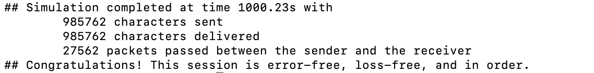
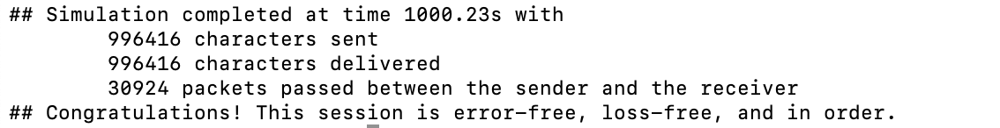
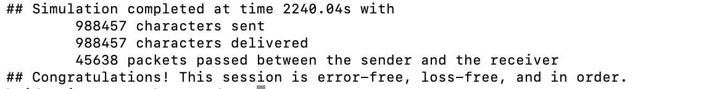
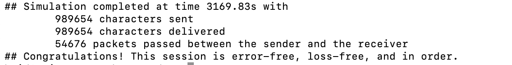
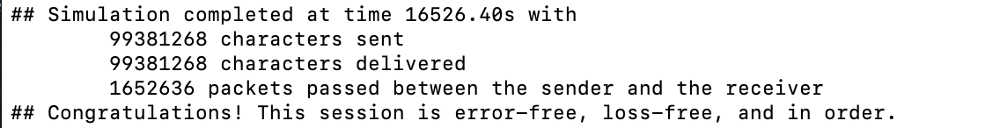
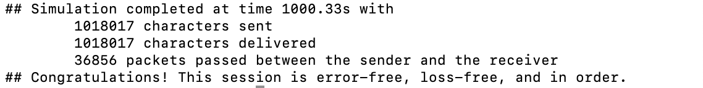
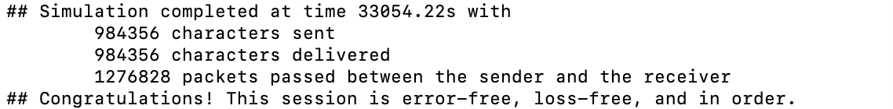
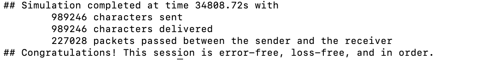

# Lab 1 - Reliable Data Transport Protocol

**name: xuhuidong** 
**id: 519021910861**
**email: 391678792hd@sjtu.edu.cn**

## 目录

- [目录](#目录)
- [问题重述](#问题重述)
- [设计思路](#设计思路)
- [函数逻辑细化](#函数逻辑细化)
- [困难与解决方案](#困难与解决方案)
- [效果](#效果)
	- [正确性测试](#正确性测试)
	- [压力测试](#压力测试)
	- [性能测试](#性能测试) 
- [参考](#参考)

## 问题重述

网络数据传输时常常遭遇数据丢失、数据被篡改等问题，为了建立稳定可靠的数据传输通道，我们可以采用 `Go-Back-N` 或 `Selective-Repeat` 的策略保证 `At-Least-Once` 效果，并对数据进行适当的加密防止遭受篡改。

本次 `lab` 要求完成 `sending side` 和 `receiving side` 的 `rdt layer` 的设计和实现，并且保证在数据出错、数据遭篡改以及数据乱序等情况下正常运行，语言规定为 `C++`。

## 设计思路

`Go-Back-N` 和 `Selective-Repeat` 都能够实现本次 `lab` 要求，而我也确实是先完成了 `Go-Back-N` 的代码架构，然后经过修改完善，最终实现了 `Selective-Repeat`。

[Selective Repeat Protocol](https://en.wikipedia.org/wiki/Selective_Repeat_ARQ) 使用 **选择性重传** 来确保数据不会丢失。

具体思路是：使用 [滑动窗口](https://www.tutorialspoint.com/what-is-selective-repeat-arq-in-computer-networks) 策略来控制不用等待 `ack` 的发送量，若收到 `ack` 则根据 `seq_num` 来向后滑动窗口，若收到 `nack` 则将对应 `seq_num` 的数据包重新发送，若超时则将滑动窗口内的所有数据包依次重新发送。

在发送端缓存所有发送数据，以防止滑动窗口无法装下所有数据而造成的数据丢失，在得到相应的 `ack` 后可以删除相应缓存。在接收端缓存所有的接收数据，以防止数据乱序而丢包，当接收端将顺序的数据发送给上层时才可以将相应的缓存删除。

```C++
|<-  4 byte  ->|<-  2 byte  ->|<-  1 byte  ->|<-  the rest  ->|
| sequence_num |  hash_value  | payload size |<-  payload   ->|
```

发送端的数据包设计如上，`sequence_num` 用来表示数据包序列号，范围是 $[0, 2^{32} - 1]$。`hash_value` 是对 `sequence_num` 和 `payload_size` 和 `payload` 整体进行哈希加密并除余 `0x00007fff` 得到的值，用来检测数据包在网络传输过程中是否遭到篡改。`payload size` 用来表明 `payload` 的大小，`payload` 就是真正要传输的数据。

```C++
|<-  4 byte  ->|<-  2 byte  ->|<-  1 byte  ->|
| sequence_num |  hash_value  |  ack or nack |
```

接收端的数据包设计如上，`sequence_num` 用来表示数据包序列号，范围是 $[0, 2^{32} - 1]$。`hash_value` 是对 `sequence_num` 和 `ack or nack` 整体进行哈希加密并除余 `0x00007fff` 得到的值，用来检测数据包在网络传输过程中是否遭到篡改。`ack or nack` 则用来表明这是 `ack` 消息还是 `nack` 消息。

## 函数逻辑细化

在每个函数的开头结尾，都会进行相应地上锁和解锁操作，保证数据的一致性。在 `Receiver_Init`，`Receiver_Final`，`Sender_Init` 和 `Sender_Final` 仅仅做了简单的初始化和释放空间工作，不在此赘述。其他函数逻辑描述如下。

`Sender_FromUpperLayer`

1. 对上层发送端传来的数据进行拆分和包装成 `packet`，并放入 `sender_window` 中缓存。
2. 发送前 `window_size` 个数据包并开始计时 `Sender_StartTimer`。

`Sender_FromLowerLayer`

1. 重新计时。
2. 解析接收端传来的 `ack` 或 `nack` 的 `packet`。
3. 判断哈希值是否一致，若一致则继续，否则直接结束
4. 如果是 `ack` 消息，则将滑动窗口向后移动，并发送新的数据包。如果是 `nack` 消息，则将对应的数据包重新发送。
5. 如果滑动窗口中为空，则数据传输结束，停止计时。

`Sender_Timeout`

1. 重新计时。
2. 将滑动窗口中所有的数据包依次重新发送。

`Receiver_FromLowerLayer`

1. 解析发送端传来的数据包。
2. 判断哈希值是否一致来判断数据包是否遭篡改。
3. 如果没有被篡改且 `seq_num` 正好等于接收端的 `next_seq_num`，则将该数据包向上传输给上层，并不断将缓存中下一个 `seq_num` 的数据包向上传输直到没有对应的缓存。如果没有被篡改且 `seq_num` 大于接收端的 `next_seq_num`，则将该数据缓存并将 `next_seq_num` 的 `nack` 数据包发送回发送端。其他情况均将 `next_seq_num` 的 `ack` 数据包发送回发送端。

## 困难与解决方案

- 在数据遭受篡改的问题中，由于之前仅加密 `payload` 而没有加密其他数据如 `seq_num`，可能会导致哈希验证成功但实际数据遭篡改的问题，解决方案就是将所有数据进行加密。
- 在数据乱序时，接收端如果仅仅接收顺序的数据包，而将超前到达的数据包丢弃的话，会造成大量的包浪费，效率很低，所以在接收端做一个缓存即可，而且在 `Receiver_FromLowerLayer` 函数中的参数 `pkt` 这个指针变量的内容会改变！！所以缓存时需要深拷贝一份数据。
- 在接收端获得超前数据包时，会向发送端发送 `nack` 的消息，之前的设计是发送多条 `nack`，但实际上这样很浪费，所以改用仅发送 `next_seq_num` 的 `nack` 即可。

## 效果

我是在 `macOS` 上的终端运行的，具体的参数如下。


### 正确性测试

`./rdt_sim 1000 0.1 100 0 0 0 0`



`./rdt_sim 1000 0.1 100 0.02 0.02 0.02 0`



`./rdt_sim 1000 0.1 100 0.15 0.15 0.15 0`



`./rdt_sim 1000 0.1 100 0.3 0.3 0.3 0`



### 压力测试

文本长度超长：`./rdt_sim 1000 0.1 10000 0 0 0 0`



乱序率超高：`./rdt_sim 1000 0.1 100 0.95 0 0 0`



丢包率超高：`./rdt_sim 1000 0.1 100 0 0.95 0 0`


篡改率超高：`./rdt_sim 1000 0.1 100 0 0 0.95 0`



乱序率、丢包率、篡改率均超高：`./rdt_sim 1000 0.1 100 0.8 0.8 0.8 0`



### 性能测试

同样的条件下，不妨对比给出的样例。可以看出，本身 `Selective-Repeat` 就比 `Go-Back-N` 性能要好，而我的实现中，无论是从耗时还是传输的宝的数量都较样例中 `Selective-Repeat` 好。

`./rdt_sim 1000 0.1 100 0.3 0.3 0.3 0`

```python
## GBN - EXAMPLE
## Simulation completed at time 7019.09s with
	 1010200 characters sent
   1010200 characters delivered
   153855 packets passed between the sender and the receiver
## Congratulations! This session is error-free, loss-free, and in order.

## SR - EXAMPLE
## Simulation completed at time 4321.40s with
   984465 characters sent 
   984465 characters delivered 
   59417 packets passed between the sender and the receiver 
## Congratulations! This session is error-free, loss-free, and in order.

## SR - MY RELIZATION
## Simulation completed at time 3169.83s with
   989654 characters sent 
   989654 characters delivered 
   54676 packets passed between the sender and the receiver 
## Congratulations! This session is error-free, loss-free, and in order.
```

## 参考

https://en.wikipedia.org/wiki/Selective_Repeat_ARQ

https://www.tutorialspoint.com/what-is-selective-repeat-arq-in-computer-networks

https://blog.csdn.net/weixin_44027897/article/details/90524447

https://www.baeldung.com/cs/networking-go-back-n-protocol

[E. Weldon, "An Improved Selective-Repeat ARQ Strategy," in IEEE Transactions on Communications, vol. 30, no. 3, pp. 480-486, March 1982, doi: 10.1109/TCOM.1982.1095497.](https://ieeexplore.ieee.org/abstract/document/1095497)

