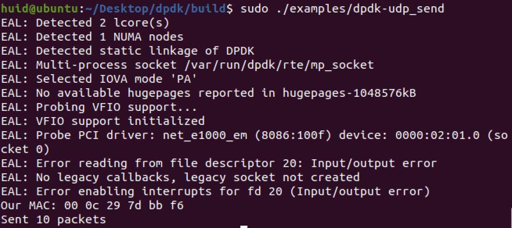
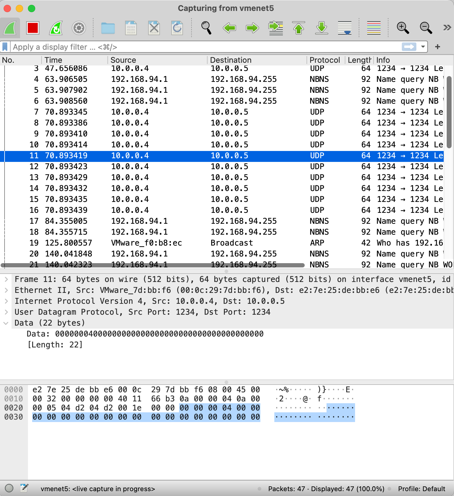
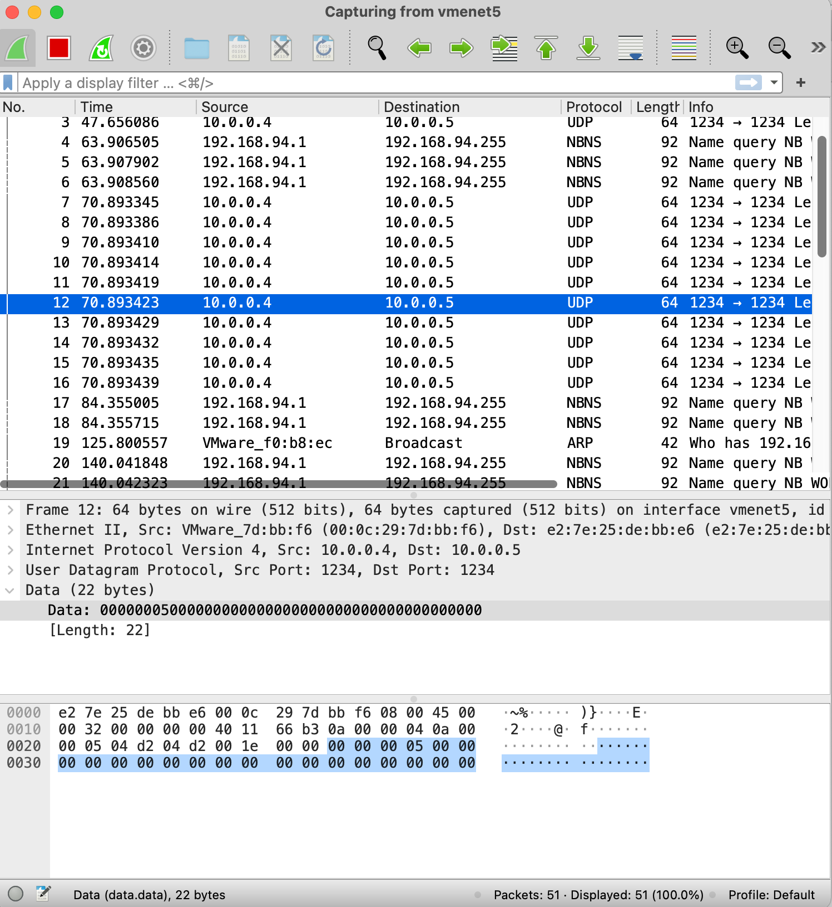

# Lab 2 – send and receive packets with DPDK

**name: xuhuidong** 
**id: 519021910861**
**email: 391678792hd@sjtu.edu.cn**

## 目录

- [目录](#目录)
- [熟悉 DPDK](#熟悉-DPDK)
- [使用 DPDK](#使用-DPDK)
- [参考](#参考)


## 熟悉 DPDK

> Q1: What's the purpose of using hugepage?

Hugepage support is required for the large memory pool allocation used for packet buffers (the HUGETLBFS option must be enabled in the running kernel as indicated the previous section). By using hugepage allocations, performance is increased since fewer pages are needed, and therefore less Translation Lookaside Buffers (TLBs, high speed translation caches), which reduce the time it takes to translate a virtual page address to a physical page address. Without hugepages, high TLB miss rates world occur with the standard 4k page size, slowing performance.

> Q2: Take examples/helloworld as an example, describe the execution flow of DPDK programs?

1. **Initialize Environment Abstraction Layer (EAL)** using following code, which finishes the initialization process that was started before main() is called (in case of a linux enviroment). Function `rte_eal_init` is to be executed on the MAIN lcore only, as soon as possible in the application's main() function. It puts the WORKER lcores in the WAIT state.

```C++
int main(int argc, char **argv)
{
	int ret;
	unsigned lcore_id;
	
	ret = rte_eal_init(argc, argv);
	if (ret < 0)
		rte_panic("Cannot init EAL\n");
}
```

2. **Starting application unit lcores**. Once the EAL is initialized, the application is ready to launch a function on an lcore. In helloworld example, `lcore_hello` is called on every available lcore, the following is the definition os the function:

```C++
static int lcore_hello(__rte_unused void* arg)
{
	unsigned lcore_id;
	lcore_id = rte_lcore_id();
	printf("hello from core %u\n", lcore_id);
	return 0;
}
```

The code that launches the function on each lcore is as follows. Function `rte_eal_remote_launch` launch a function on another lcore which can be executed on the MAIN lcore only. The MAIN lcore sends a message to a worker lcore and returns as soon as the message is sent and knows nothing about the completion of function.

```C++
RTE_LCORE_FOREACH_WORKER(lcore_id) {
	/* Simpler equivalent. 8< */
	rte_eal_remote_launch(lcore_hello, NULL, lcore_id);
	/* >8 End of simpler equivalent. */
}
/* call it on main lcore too */
lcore_hello(NULL);
```

> Q3: Read the codes of examples/skeleton, describe DPDK APIs related to sending and receiving packets.

1. `rte_pktmbuf_pool_create` creates and initializes a packet mbuf pool, which is a wrapper to `rte_mempool` functions.

```C++
struct rte_mempool* rte_pktmbuf_pool_create	(const char* name, unsigned n, unsigned cache_size, uint16_t 	priv_size, uint16_t data_room_size, int socket_id)
```

Parameters `name` is the name of the mbuf pool. Parameter `n` is the number of elements in the mbuf pool. Parameter `cache_size` indicates the size of the per-core object cache. Paramter `priv_size` indicates the size of application private between the `rte_mbuf` structure and the data buffer, which must be aligned to `RTE_MBUF_PRIV_ALIGN`. Parameter `data_room_size` indicates the size of data buffer in each mbuf, including `RTE_PKTMBUF_HEADROOM`. Parameter `socket_id` indicates the socket identifier where the memory should be allocated.

`rte_pktmbuf_pool_create` returns the pointer to the new allocated mempool on success and `NULL` on error with `rte_error` set appropriately.

2. `rte_eth_rx_burst` retrieve a burst of input packets from a receive queue of an Ethernet device. The retrieved packets are stored in `rte_mbuf` structures whose pointers are supplied in the `rx_pkts` array.

The `rte_eth_rx_burst()` function loops, parsing the Rx ring of the receive queue, up to `nb_pkts` packets, and for each completed Rx descriptor in the ring, it performs the following operations:

- Initialize the `rte_mbuf` data structure associated with the Rx descriptor according to the information provided by the NIC into that Rx descriptor.
- Store the `rte_mbuf` data structure into the next entry of the `rx_pkts` array.
- Replenish the Rx descriptor with a new `rte_mbuf` buffer allocated from the memory pool associated with the receive queue at initialization time.

When retrieving an input packet that was scattered by the controller into multiple receive descriptors, the `rte_eth_rx_burst()` function appends the associated `rte_mbuf` buffers to the first buffer of the packet.

The `rte_eth_rx_burst()` function returns the number of controller into multiple receive descriptors, the `rte_eth_rx_burst()` function appends the associated `rte_mbuf` buffers to the first buffer of the packet.

```C++
static uint16_t rte_eth_rx_burst (uint16_t port_id, uint16_t queue_id, struct rte_mbuf** rx_pkts, const uint16_t nb_pkts)	
```

Parameter `port_id` is the port identifier of the Ethernet device. Parameter `queue_id` indicates the index of the receive queue from which to retrieve input packets. Parameter `rx_pkts` indicates the address of an array of pointers to `rte_mbuf` structures that must be large enough to store `nb_pkts` pointers in it. Parameter `nb_pkts` is the maximum number of packets to retrieve. 

3. `rte_pktmbuf_free` free a packet mbuf back into its original mempool. It free an mbuf, and all its segments in case of chained buffers. Each segment is added back into its original mempool. 

```C++
static void rte_pktmbuf_free (struct rte_mbuf* m)	
```

Parameters `m` indicates the packet mbuf to be freed. If NULL, the function does nothing.

> Q4: Describe the data structure of `rte_mbuf`.

- `__rte_aligned()`: Physical address of segment buffer.
- `buf_addr`: Virtual address of segment buffer.
- `refcnt`: Reference counter to support zero-copy broadcast.
- `nb_segs`: Number of segments. Only valid for the first segment of an mbuf chain.
- `port`: Input port.
- `ol_flags`: Offload features.
- `packet_type`: L2/L3/L4 and tunnel information.
- `I2_type`: (Outer) L2 type.
- `I3_type`: (Outer) L3 type.
- `I4_type`: (Outer) L4 type.
- `tun_type`: Tunnel type.
- `inner_esp_next_proto`: ESP next protocol type, valid if RTE_PTYPE_TUNNEL_ESP tunnel type is set on both Tx and Rx.
- `inner_I2_type`: Inner L2 type.
- `inner_I3_type`: Inner L3 type.
- `inner_I4_type`: Inner L4 type.
- `pkt_len`: Total pkt len: sum of all segments.
- `data_len`: Amount of data in segment buffer.
- `vlan_tci`: VLAN TCI (CPU order), valid if RTE_MBUF_F_RX_VLAN is set.
- `rss`: RSS hash result if RSS enabled.
- `lo`: Second 4 flexible bytes.
- `hi`: First 4 flexible bytes or FD ID, dependent on RTE\_MBUF\_F\_RX\_FDIR\_ flag in ol_flags.
- `fdir`: Filter ientifier if FDIR enabled.
- `sched`: Hierarchical scheduler.
- `txq`: The event eth Tx adapter uses this field to store Tx queue id.
- `txadapter`: Eventdev ethdev Tx adapter User defined tags.
- `hash`: hash information.
- `vlan_tci_outer`: Outer VLAN TCI (CPU order), valid if RTE_MBUF_F_RX_QINQ is set.
- `buf_len`: Length of segment buffer.
- `pool`: Pool from which mbuf was allocated.
- `next`: Next segment of scattered packet. Must be NULL in the last segment or in case of non-segmented packet.
- `tx_offload`: combined for easy fetch.
- `l2_len`: L2 (MAC) Header Length for non-tunneling pkt.
- `l3_len`: L3 (IP) Header Length.
- `l4_len`: L4 (TCP / UDP) Header Length.
- `tso_segsz`: TCP TSO segment size.
- `outer_l3_len`: OUter L3 (IP) Hdr Length.
- `outer_l2_len`: Outer L2 (MAC) Hdr Length.
- `shinfo`: Shared data for external buffer attached to mbuf.
- `priv_size`: Size of the application private data.
- `timesync`: Timesync flags for use with IEEE1588.
- `dynfield1`: Reserved for dynamic fields.

## 使用 DPDK

### 命令

```bash
# 以下命令每次开机都要执行
$ cd build
$ sudo ninja install
$ mkdir -p /dev/hugepages # 创建 hugetlbfs 挂载点, 每次开机都要执行
$ mountpoint -q /dev/hugepages || mount -t hugetlbfs nodev /dev/hugepages # 挂载 hugetlbfs, 每次开机都要执行
$ sudo bash -c 'echo 64 > /sys/devices/system/node/node0/hugepages/hugepages-2048kB/nr_hugepages' # 分配大页, 每次开机都要执行

# 跑实例程序
$ cd examples # 进入 DPDK 中的例子
$ sudo ./dpdk-helloworld # 运行

# 以下命令每次开机都要执行
$ sudo ifconfig ens33 down # 停止 ens33 网卡的工作，ens33 为刚激活的 host-only 模式下的虚拟网卡
$ sudo modprobe uio
$ cd ./kernel/linux/igb_uio
$ make
$ sudo insmod igb_uio.ko
$ cd ../../../
$ sudo usertools/dpdk-devbind.py --bind=igb_uio ens33
$ sudo usertools/dpdk-devbind.py -s # 验证虚拟网卡是否被成功绑定到 DPDK 上
```

### 完成 UDP 小例子

在 `./dpdk/examples/` 中创建 `udp_send` 文件夹，并在 `basic_fwd.c` 中完成代码。

在 `./dpdk/examples/meson.build` 中添加 `udp_send.c`，并使用 `sudo ninjia install` 命令编译。

执行 `sudo ./dpdk/examples/dpdk_udp_send` 后，从虚拟机中成功向本机发送 10 个 UDP 包。代码 `do_send(mbuf_pool, 10)` 中数字可以更改发送包的数量。



在本机中使用 wireshark 接收到连续发送的 10 个 UDP 包，每个包的内容是对应的单调递增数字编号（0-based）。

```C++
uint32_t *payload = (uint32_t *)(udp + 1);
static uint32_t seq_num = 0;
*payload = htonl(seq_num++);
```

如下图第 5 个包的编号为 4。



而之后的一个包的编号就是 5。




## 参考

http://doc.dpdk.org/guides/sample_app_ug/hello_world.html

https://doc.dpdk.org/api/rte__launch_8h.html#acc0b1cfdc31fa73329acd51dcea31210

http://doc.dpdk.org/guides/sample_app_ug/compiling.html

https://zenhox.github.io/2018/01/25/dpdk-pktSR/

https://dpdk-docs.readthedocs.io/en/latest/prog_guide/packet_framework.html