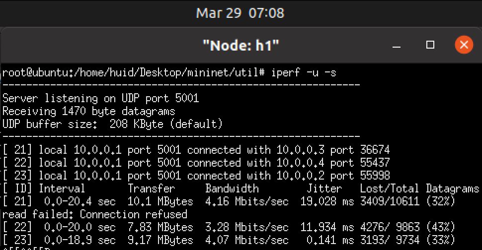

# Lab3: QoS Implementation with OvS

**name: xuhuidong** 
**id: 519021910861**
**email: 391678792hd@sjtu.edu.cn**

## 目录

- [目录](#目录)
- [Part1: 创建网络拓扑](#Part1-创建网络拓扑)
- [Part2: 三种限速方式](#Part2-三种限速方式)
- [Part3: 拓展与应用](#Part3-拓展与应用)
- [参考](#参考)

## Part1: 创建网络拓扑

使用 iperf 测试两台虚拟主机 `h1` 和 `h2` 之间的连通性。

#### Task 1: Node: h1 的输出结果为：


#### Task 1: Node: h2 的输出结果为：


## Part2: 三种限速方式

### 网卡限速

- 带宽：5.57 Mbits/sec
- 抖动：15.655 ms
- 丢包率：46 %

#### Task 2.1: Node: h1 的输出结果为


#### Task 2.1: Node: h2 的输出结果为


### 队列限速

- 带宽：4.67 Mbits/sec
- 抖动：9.544 ms
- 丢包率：0 %

#### Task 2.2: Node: h3 的输出结果为


#### Task 2.2: Node: h4 的输出结果为


### Meter 表限速

- 带宽：5.22 Mbits/sec
- 抖动：15.764 ms
- 丢包率：49 %

#### Q1: 理解 Line 15, Line 16 两条指令，指出每条指令的具体工作是什么，并逐个分析其中各个参数的具体含义。

```bash
$ ovs-ofctl add-flow s1 in_port=5,action=meter:1,output:6 -O openflow13
```

下发转发的流表。`in_port` 匹配进端口为 5，`action` 指明转发动作为 `meter:1, output:6`，表示匹配到的流表首先交给 meter 表处理，超过 5M 的数据包丢弃，然后再交给 `output: 6` 从端口 6 转发出去。`-O` 指明了 OpenFlow 的版本 13。

```bash
$ ovs-ofctl dump-flows s1 -O openflow13
```

查看交换机中的流表的条目。`dump-flows` 打印出 `s1` 流表的条目。`-O` 指明了 OpenFlow 的版本 13。

#### Task 2.3: Node: h5 的输出结果为


#### Task 2.3: Node: h6 的输出结果为


#### Q2: 就三组数据中的带宽、抖动和丢包率等参数，对三种限速方式进行横向比较，并适当地分析原因。

| | 带宽 Mbits/sec | 抖动 ms | 丢包率 | 带宽误差率 |
| :--: | :--: | :--: | :--: | :--: |
| 网卡限速 | 5.57 | 15.655 | 46 % | 11.4 % |
| 队列限速 | 4.67 | 9.544 | 0 % | 6.6 % |
| Meter 表限速 | 5.22 | 15.764 | 49 % | 4.4 % |

从数据来看，队列限速的表现最好，带宽限制在了 5 Mb 以内，且抖动最小，丢包率也最小。

而网卡限速表现最不好，带宽的误差率最高，抖动也很高，这与网卡限速的实现方式有关，其控制精度比较粗粒度。

Meter 表作为 SDN 模式限速的代表，表现中等，这可能与 ovs 交换的流表控制能力有关。交换机中流表的匹配，数据流计数，动作的执行等都是影响其控制粒度的原因。软件实现的交换机对流表的控制比不上硬件交换机，如果使用硬件交换机其效率表现应该有所提高。

## Part3: 拓展与应用

我们首先先清理之前 part 遗留下来的限速队列。

```bash
$ ovs-vsctl clear port s1-eth1 qos
$ ovs-vsctl clear port s1-eth2 qos
$ ovs-vsctl clear port s1-eth3 qos
$ ovs-vsctl clear port s1-eth4 qos
```

我们可以用如下命令清理所有限速队列并检查是否清理干净。

```bash
$ ovs-vsctl -- --all destroy qos -- --all destroy queue
$ ovs-vsctl list qos
$ ovs-vsctl list queue
```

#### Task3: 在限制 Server 端（h1）的带宽为 10Mb 的前提下，观察稳定后的三个 Client 的带宽，将结果截图并简单分析。

使用队列限速对 Server 端控制带宽为 10 Mb。

```bash
$ ovs-vsctl set port s1-eth4 qos=@newqos -- --id=@newqos create qos type=linux-htb queues=0=@q0 -- --id=@q0 create queue other-config:max-rate=5000000
$ h1 iperf -u -s
```



然后 "手动同时" 运行三个 Client。

```bash
$ h2 iperf -u -c 10.0.0.1 -b 10M -t 20 -i 1
$ h3 iperf -u -c 10.0.0.1 -b 10M -t 20 -i 1
$ h4 iperf -u -c 10.0.0.1 -b 10M -t 20 -i 1
```

并观察稳定后（即三个 Client 并行时）的带宽。可以发现，三个 Client 几乎均分了 Server 的 10 M 带宽。


#### Task4: 通过上述三种限速的方式来达成目标，记录设计过程（思路及运行指令），并将稳定后的三个 Client 的带宽结果截图。

考虑到网卡限速并不能细粒度限制不同 Client 的带宽，因此网卡限速不适合此场景。

所以，我们使用 meter 表限速结合队列限速来控制三个 Client 的带宽。我们限制 Server 端（`h1`）总带宽为 10Mb，并且根据三个 Client 的要求分别限制。

- `h2` 优先级高：5 Mb 及以上
- `h3` 优先级中等：3 Mb 及以上
- `h4` 优先级低：在保证 `h2` 和 `h3` 的前提下尽量多。


因此我们对可以在 Server 端限制三个队列，分别对应于三个 Client。每个队列根据 Client 要求分别设置带宽下限 `min-rate` 分别为 5 Mb、3 Mb 和 0 Mb。而还有 2 Mb 带宽我将其均分给三个 Client，因此设置带宽上限 `max-rate` 分别为 5.7 Mb、3.7 Mb 和 0.7 Mb。

```bash
$ sudo ovs-vsctl set port s1-eth1 qos=@qos1 -- --id=@qos1 create qos type=linux-htb queues=2=@q2,3=@q3,4=@q4 -- \
--id=@q2 create queue other-config:max-rate=5700000 other-config:min-rate=5000000 -- \
--id=@q3 create queue other-config:max-rate=3700000 other-config:min-rate=3000000 -- \
--id=@q4 create queue other-config:max-rate=700000 other-config:min-rate=0
```


然后我们下发流表并且分别指定不同队列给不同 Client，并查看。

```bash
$ ovs-ofctl add-flow s1 in_port=2,action=set_queue:2,output:1 -O openflow13
$ ovs-ofctl add-flow s1 in_port=3,action=set_queue:3,output:1 -O openflow13
$ ovs-ofctl add-flow s1 in_port=4,action=set_queue:4,output:1 -O openflow13
$ ovs-ofctl dump-flows s1 -O openflow13
```


在 Server 端（`h1`）运行命令

```bash
$ iperf -u -s
```


在三个 Client 端（`h2`、`h3`、`h4`）分别同时运行命令

```bash
$ iperf -u -c 10.0.0.1 -b 10M -t 20 -i 1
```

可以看出，Client `h2` 带宽稳定在 5.57 Mb 左右，Client `h3` 带宽稳定在 3.6 Mb 左右，Client `h4` 带宽稳定在 0.7 Mb 左右，符合题目要求且几乎用尽了 Server `h1` 的全部带宽。


## 参考

https://www.sdnlab.com/23289.html

https://www.cxyzjd.com/article/u012707739/85337640

https://blog.51cto.com/u_13958494/2177890

https://www.sdnlab.com/23289.html

https://github.com/mininet/mininet

http://www.openvswitch.org/support/dist-docs/ovs-vsctl.8.txt

https://mailman.stanford.edu/pipermail/mininet-discuss/2015-March/005837.html

https://lists.linuxfoundation.org/pipermail/ovs-discuss/2015-November/019565.html

https://mailman.stanford.edu/pipermail/mininet-discuss/2014-February/004089.html

https://www.eet-china.com/mp/a82420.html

https://cloud.tencent.com/developer/article/1667220

https://docs.pica8.com/pages/viewpage.action?pageId=3083175


