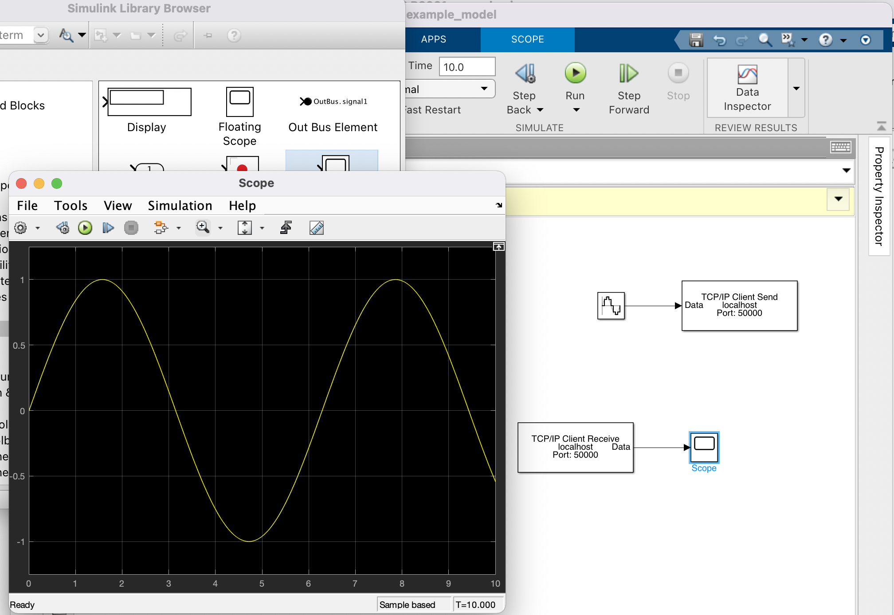
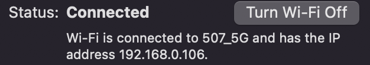

# 无人系统设计 课程作业 02

**班级：F1903703**   												**学号：519021910861** 														**姓名：徐惠东**

------

## 目录

- [目录](#目录)
- [作业1](#作业1)
- [作业2](#作业2)
- [作业3](#作业3)

## 作业 1

#### 完成 "Send and Receive Data over TCP/IP Network" 实例的 [链接](https://ww2.mathworks.cn/help/instrument/send-and-receive-data-over-a-tcpip-network.html) 中的所有步骤。

#### 将 3 路信号合成而成复合向量信号，并观察 "TCP/IP Client Receive" 模块输出端示波器的波形。

#### 在 "TCP/IP Client Receive" 模块输出端旁路 "Demux" 模块，将接收信号分解为 3 路输出，分别接入新的 "Scope"。运行观察各自的输出波形。

可以看出，三个输入信号在输出端被完整分解成原来的三个信号。

#### 将上一步骤中，Demux模块分路出来的 3 路信号，接入一个新加入的 3 输入"Scope"，观察输出波形。

可以看到，经过 Demux 模块分出的 3 路信号在 3 输入的 "Scope" 中同时显示。

## 作业 2

#### 将自己的电脑，与另外 2 台电脑（可以是另外 2 位同学的电脑），通过以上模块的扩展设计，进行与上述 2 台电脑的同时数据双向互通。简要陈述设计过程和实验结果。

> 这项作业由我和 康艺潇、林祺龙 同学合作完成。

首先，我在本机的 WiFi 管理界面 http://192.168.0.1/index.html 设置端口转发。

注意在 Matlab 中运行命令 `echotcpip('on', 50000)` 将端口 50000 打开。

然后查询到自己的 WAN IP：59.82.6.82，IP：192.168.0.106。

下载并使用 socket 工具 SSokit。

**主要思路是**

用 SSokit（Socket 工具）来和 simulink 通信。第一部分，一位同学的 simulink 发送信号给另外两位同学的 SSokit，另外两个同学的 SSokit 上会出现对应的消息。第二部分，另外两位同学同时发送信号给正在运行 simulink 的同学，这位同学应该可以在两个对应的 scope 上显示收到的数据信号。为了以示区分，三个同学的信号分别为：徐惠东：1 的常数信号，林祺龙：脉冲信号，康艺潇：-1 的常数信号。下用姓氏表示：徐，林，康。三人的 IP 分别是 59.78.6.82，59.78.14.250，59.78.4.161。

- **林运行 simulink ，徐和康使用 SSokit 。可以看到林的 simulink 界面上收到了两条 1 和 -1 的常数信号，徐和康的 SSokit 收到林的脉冲信号，成功。**

	
	
	
林的 simulink 界⾯，可以看到收到了两条 1 和 -1 的信号，成功

	
	<figure class="half"></figure>
	
左侧是徐的 SSokit 收到了林的脉冲信号，右侧是康的 SSokit 收到了林的脉冲信号。

- **徐运行 simulink，康和林使用 SSokit。可以看到徐的 simulink 界面上收到了 -1 的常数信号和脉冲信号，康和林的 SSokit 收到徐的 1 的常数信号，成功。**

	
	
	
徐的 simulink 界面，可以看到收到了康的 -1 的常数信号和林的脉冲信号。

	
	<figure class="half"></figure>
	
左侧是康的 SSokit 收到了徐的 1 的常数信号，右侧是林的 SSokit 收到了徐的 1 的常数信号。

- **康运行 simulink，徐和林使用 SSokit。可以看到康的 simulink 界面上收到了 1 的常数信号和脉冲信号，徐和林的 SSokit 收到康的 -1 的常数信号，成功。**

	
	
	
康的 simulink 界面，可以看到收到了徐的 1 的常数信号和林的脉冲信号。

	
	<figure class="half"></figure>
	
左侧是徐的 SSokit 收到了康的 -1 的常数信号，右侧是林的 SSokit 收到了康的 -1 的常数信号。

## 作业 3

#### 按步骤完成以下 [链接](https://ww2.mathworks.cn/help/simulink/slref/merging-signals.html) 中的信号/数据合并实验

#### 作业："Control Merging Signals with the Push Button Block"，[链接](https://ww2.mathworks.cn/help/simulink/slref/dashboard-merge.html)。

**完成上述链接步骤并直接运行，得到下图输出，因为 `Constant = 0` 所以会执行下面的子模块因此输出匹配。**

**设置 `signal_select` 中的 `On Value` 为 1。重新运行，并在运行过程中长按`signal_select` 一段时间（即 `Constant = 1`），则那一段时间的输出会变成上面的子模块，从图中波形也可以看出有部分是正弦图像，因此输出匹配。**

