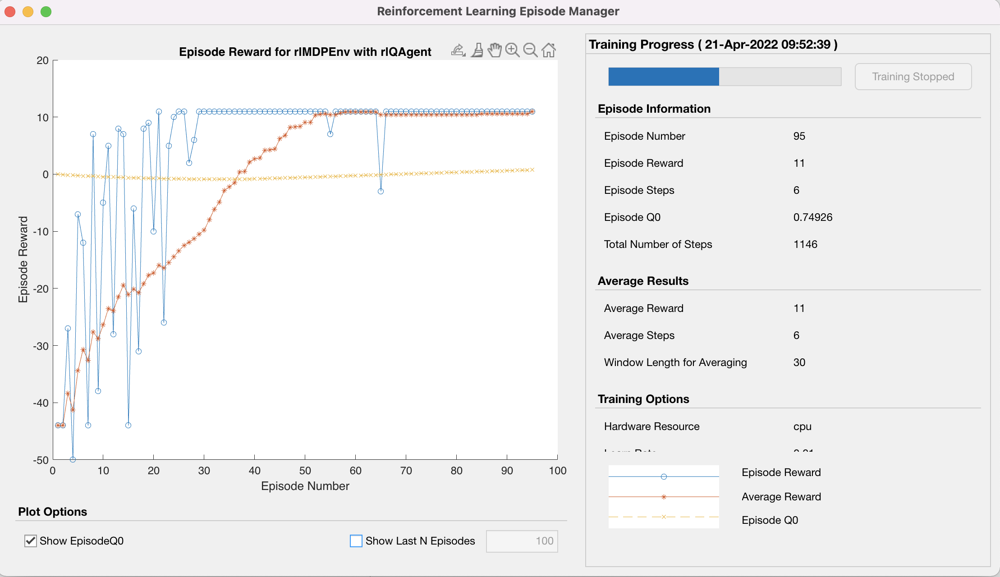
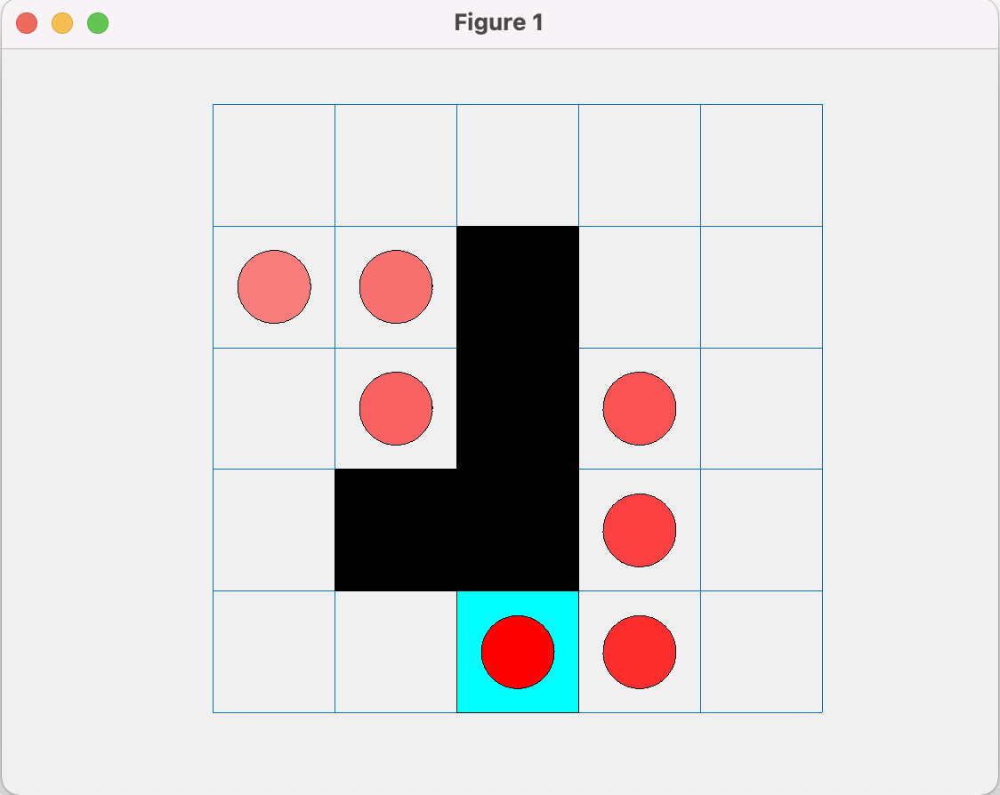
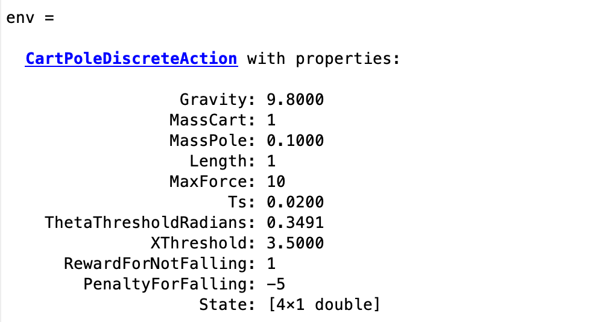
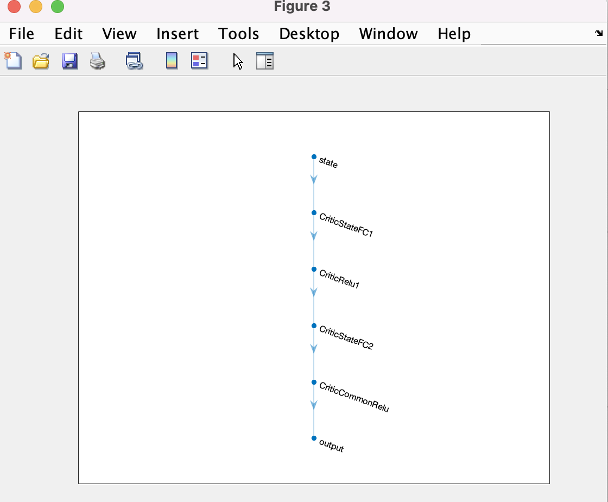
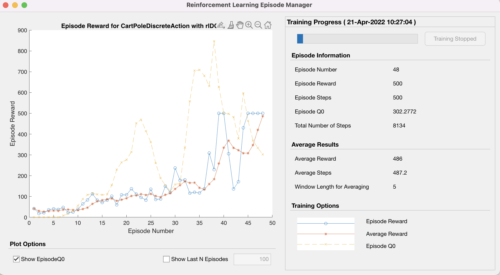
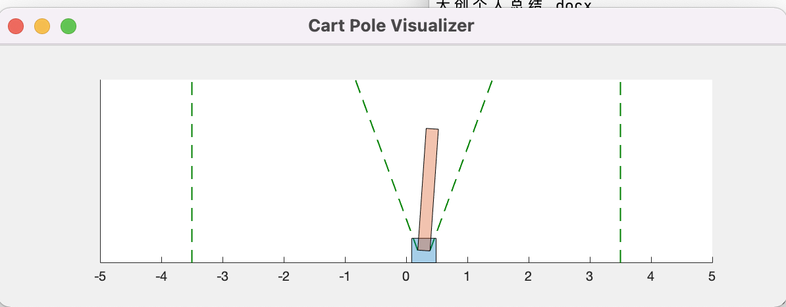
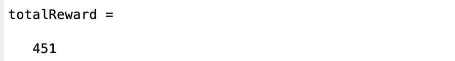

# 无人系统设计 课程作业 03

**班级：F1903703**   												**学号：519021910861** 														**姓名：徐惠东**

------

## 目录

- [目录](#目录)
- [网格系统](#网格系统)
- [车杆系统](#车杆系统)

## 网格系统

> 结合课堂所讲内容，参考https://ww2.mathworks.cn/help/reinforcement-learning/ug/train-q-learning-agent-to-solve-basic-grid-world.html， 使用提供的新环境GridWorld.m，完成GridWorldExample.m中的剩余代码，实现Agent以最大Reward到达终点。

首先我们创建基本的网格环境并初始化随机种子。

```Matlab
env = GridWorld;
env.ResetFcn = @() 2;
rng(0)
```

从 `GridWorld.m` 文件中可以看出，我们创建了一个 $5\times 5$ 的网格，并且指定 $(5, 3)$ 为终止点，$(2, 3), (3, 3), (4, 2), (4, 3)$ 是障碍点，从 $(3, 2)$ 可以跳到 $(3, 4)$ 并且奖励为 $5$。

```Matlab
GW.TerminalStates = "[5,3]";
GW.ObstacleStates = ["[2,3]";"[3,3]";"[4,2]";"[4,3]"];
...
GW.R(state2idx(GW,"[3,2]"),state2idx(GW,"[3,4]"),:) = 5;
```

然后，我们首先使用网格环境中的观察和动作创建一个 Q-Table，设置学习率为 $0.01$，并创建一个 QValue-Function 并对 epsilon-greedy 接口进行初始化，最终创建出一个 Q-Learning 智能体。

```Matlab
qTable = rlTable(getObservationInfo(env), getActionInfo(env));
qFunction = rlQValueRepresentation(qTable, getObservationInfo(env), getActionInfo(env));
...
agentOpts.DiscountFactor = 0.99;
qAgent = rlQAgent(qFunction, agentOpts);
```

然后，我们指定一些训练时的参数，例如：最多训练 $200$ 个 episode，每个 episode 不超过 $50$ 步 等等。

```Matlab
trainOpts = rlTrainingOptions;
trainOpts.MaxStepsPerEpisode = 50;
trainOpts.MaxEpisodes = 200;
```

使用 `train` 函数进行训练。

```Matlab
trainingStats = train(qAgent, env, trainOpts)
```

得到的训练结果是：



从图中可以看到 `Average Reward: 11`，即最终训练结果的平均奖励值是 $11$，这也是能够达到的最优奖励值。

最后，在环境中验证训练出的智能体，可以发现，智能体选择了最优的路径

```Matlab
sim(qAgent, env)
```

$$
(2, 1) \rightarrow (2, 2) \rightarrow (3, 2) \rightarrow (3, 4) \rightarrow (4, 4) \rightarrow (5, 4) \rightarrow (5, 3)
$$



## 车杆系统

> 结合课堂所讲内容，参考 https://ww2.mathworks.cn/help/reinforcement-learning/ug/train-dqn-agent-to-balance-cart-pole-system.html ，使用提供的新环境 CartPoleAbstract.m 、 CartPoleDiscreteAction.m ，完成 CartPoleDQNExample.m中的剩余代码，实现车杆系统维持在合法的位置及角度区域。

首先，我们创建车杆系统的环境。可以看到重力加速度是 $9.8m/s$，最大推力是 $10N$ 等基本信息。

```Matlab
env = CartPoleDiscreteAction
obsInfo = getObservationInfo(env)
actInfo = getActionInfo(env)
rng(0);
```



然后我们创建了一个 $4$ 层的 DNN 神经网络。

```Matlab
dnn = dlnetwork(dnn);
```



然后我们指定一些智能体的参数，如最小的 batchsize 是 256 等，并创建智能体。

```Matlab
agentOpts = rlDQNAgentOptions(...
    'MiniBatchSize',256);
agent = rlDQNAgent(critic, agentOpts);
```

然后我们指定一些训练时的参数，如最大的 episode 是 $1000$ 等，并开始训练智能体。

```Matlab
trainOpts = rlTrainingOptions(...
    'MaxEpisodes',1000);
plot(env)
```

得到的训练结果是：



在训练过程中观察车杆，在最初的几个 episode 中，由于向某一个方向的推力过大导致摇杆很快就倾斜到了倾斜边界，慢慢地，随着训练进行，智能体学会使用更小的推力并且时刻注意倾斜角度，从而对推力的方向进行更好的把控，视觉上来看就是车杆的摇晃变得极其缓慢，每个 episode 的训练时间也大大增加。

这是训练过程中的某个瞬间：



最后我们在环境中验证智能体，发现他已经能很好地把控住车杆，能够很稳定地让车杆稳定在竖直位置左右，既不让车杆过度倾斜，也不会让车杆触碰到左右竖直边界，说明训练成功有效，可以看到最后的 Reward 相对来说也很高，没有达到 $500$ 我觉得是因为训练的 episode 不够多以及测试环境和训练环境可能存在一定差异。

