# hw4

## 倒退行走

我们需要在 Demo 的基础上进行改进，训练机器人倒退行走，可以改变智能体采取的策略、收益函数计算公式等。

那么我们就从 **强化学习** 的比较关键的因素 **激励函数** 入手，来魔改原来的 Demo，让其从正向走路变成逆向走路。

首先我们观察一下 Demo 中的激励函数是：

$$
r_t = v_x - 3y^2 - 50z^2 + 25\frac{T_s}{T_f} - 0.02\sum_i (u^i_{t - 1})^2
$$

- $v_x$ 代表 **向 $x$ 轴正方向的速度激励**，这一项是正的，意味着机器人沿着 $x$ 正方向行走是 **被鼓励的**。
- $y$ 代表 **向 $y$ 轴正方向的位移**，在公式中这一项是 $-3y^2$，意味着向 $y$ 轴正负方向的偏移都是 **被惩罚的**。
- $z$ 代表 **向 $z$ 轴正方向的位移**，在公式中这一项是 $50z^2$，系数这么大的惩罚项主要是为了限制机器人的重心不能上下移动太多，不然可能会做出正常人类做不到的动作，比如原地弹跳飞天。
- $\frac{T_s}{T_f}$ 代表 **时间激励**，这一项是正的，意味着 **鼓励** 机器人更长时间的运动，这一项存在的意义在于防止机器人以 **极大的 $x$ 方向速度** 来获得短期内的高激励而不真正行走很久。
- $u^i_{t - 1}$ 是 **关节扭矩**，这一项是负的，是为了 **惩罚** 机器人通过大大增加关节扭矩而达到很快的行走速度，因为正常人是做不到这样的，或者说这么做会对关节造成很大的伤害，不符合人类走路的规律。

所以在 Demo 中机器人 **正向行走** 主要靠的是 **$x$ 轴的速度激励** 和 **$y$ 轴的位移惩罚**。因此，要让机器人 **逆向行走**，我们理论上只需要改变 **$x$轴 的速度激励** 项的符号，表明我们 **鼓励** 机器人沿着 $x$ 轴负方向行走即可。

在实际训练过程中，我们发现可能是由于机器人的关节活动限制，导致向后行走的难度会高于向前行走，以至于机器人很容易用 **迅速向后摔倒** 来 **骗取短时间内很高的激励**，因此我们将 **时间激励** 的系数翻倍，来 **鼓励** 机器人持续倒走。最终的激励函数如下：

$$
r_t = -v_x - 3y^2 - 50z^2 + 50\frac{T_s}{T_f} - 0.02\sum_i (u^i_{t - 1})^2
$$

根据公式修改后的 `rlWalkingBipedRobot.slx` 文件如下：

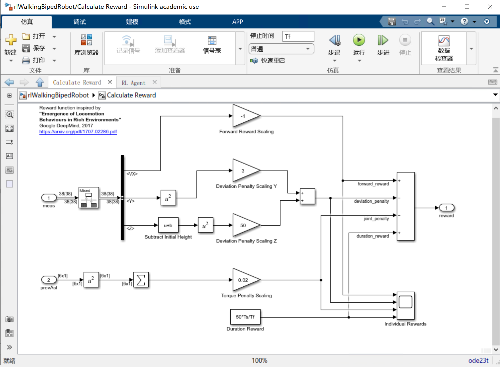

我们采用 `rlTD3Agent` 进行训练，在训练过程中我们发现前 `500` 个 `episode` 机器人的 `episode reward` 都比较小，应该是在学习 **如何正确地走路而不摔倒**，在 `500 ~ 900` 个 `episode` 时机器人的 `episode reward` 迅速增大且波动也很大，应该是已经克服了走路障碍开始学习如何更好地在 $x$ 轴上倒走而不向 $y$ 轴偏移或摔倒，这时候机器人会进行一些比较极端（或者说有创新性）的试探所以 `episode reward` 波动很大，与此同时由于激励函数的正确设置，机器人已经逐渐学会稳步向后行走了所以 `episode reward` 整体趋势是增大的。在 `900 ~ 1700` 个 `episode` 我们发现机器人的 `episode reward` 已经趋于稳定收敛，表明它应该已经学会了如何长时间向 $x$ 轴负方向行走而不摔倒，所以我们就可以及时停止训练并通过模拟来检验训练成果了。

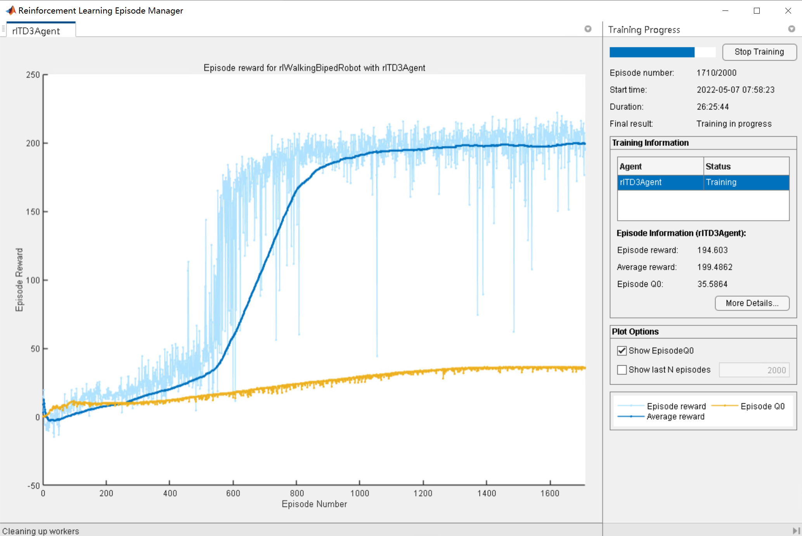

我们录制了 [倒退行走-成功.mp4](./README/倒退行走-成功.mp4) 视频来演示 **倒退行走** 的最终训练效果，可以看到机器人很稳地在向后倒退行走，符合我们的预期，也反映出我们的激励函数设置是合理的。

## 横着走

经过倒退行走的魔改训练成功后，我们满怀信心地想要尝试让他学会横着走，毕竟就是改个 **速度激励** 和 **位移激励** 的事嘛？我们抱着这样的态度进行了尝试。

之前倒退行走给的是 **$x$ 轴正方向速度奖励和 $y$ 轴正负方向位移惩罚**，那么我们这次就依葫芦画瓢，激励函数改成对 **$y$ 轴正方向速度奖励和 $x$ 轴正负方向位移惩罚**，具体激励函数如下：

$$
r_t = v_y - 3x^2 - 50z^2 + 25\frac{T_s}{T_f} - 0.02\sum_i(u^i_{t - 1})^2
$$

当然，我们还需要改变终止条件中 $|Y| \geq 1$，我们最初是将这一项替换成 $|X| \geq 1$，但发现每个 `episode` 训练时间都太短了，训练效果也不好，于是我们直接移除了这一项进行训练。

然而，实际训练效果不尽人意，`episode reward` 一直上不去，说明机器人并没能很好地得到有效训练，于是我们就停止了训练看看效果，发现机器人就只会在起点处便身体往 $y$ 轴正方向一斜然后倒下就没了，仔细一想这么做确实即避免了向 $x$ 轴的位移惩罚还得到了短时间内较大的 $y$ 轴正方向速度奖励，除了舍弃了 **时间激励** 以外，其他的好像都很合理。

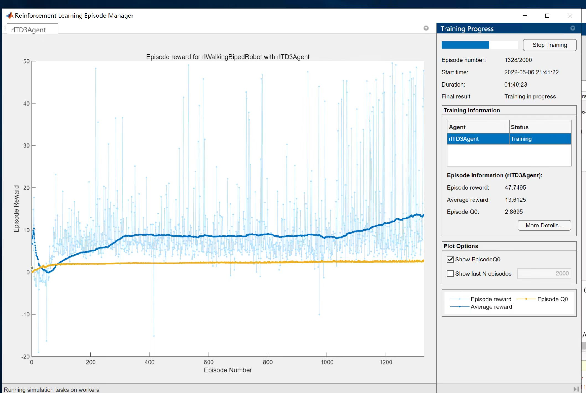

我们于是又调大了时间激励试图让它多行走一会儿，但训练效果依旧很糟糕。所以我们想了想，发现关节的活动范围限制意味着机器人不能完全像人类一样，向左或向右提胯横向行走，这也就导致我们对 激励函数 和 终止条件 的魔改是无法从根本上改变这一缺陷的。

但同时我们也发现，在直线行走的过程中机器人总是会不自觉地走偏，我们猜测是因为重心不稳的原因导致机器人时常要调整自己的脚步来保持平衡，所以也就会积累偏差，那么我们是不是可以利用这一特性设计出 **斜着走** 的机器人呢？

## 斜着走

按照老套路，我们先尝试对最初的 Demo 进行魔改，于是我们将斜着走固定为 $x$ 轴正方向与 $y$ 轴正方向夹角为 $45$ 度，然后依次对速度激励和位移激励做替换，并且修改终止条件。

比如沿着斜线方向的速度应该是 $\text{sign}(v_x)\times\sqrt{v_x^2 + v_y^2}$，而根据数学几何计算，同理也可以计算出沿着斜线的切线偏移量是 $\frac{\sqrt{2}}{2} \times |x - y|$，所以最终的激励函数我们设置成：

$$
r_t = \sqrt{v_x^2 + v_y^2} - 3 \times (x - y) ^ 2 - 50z^2 + 25\frac{T_s}{T_f} - 0.02\sum_i (u^i_{t - 1})^2
$$

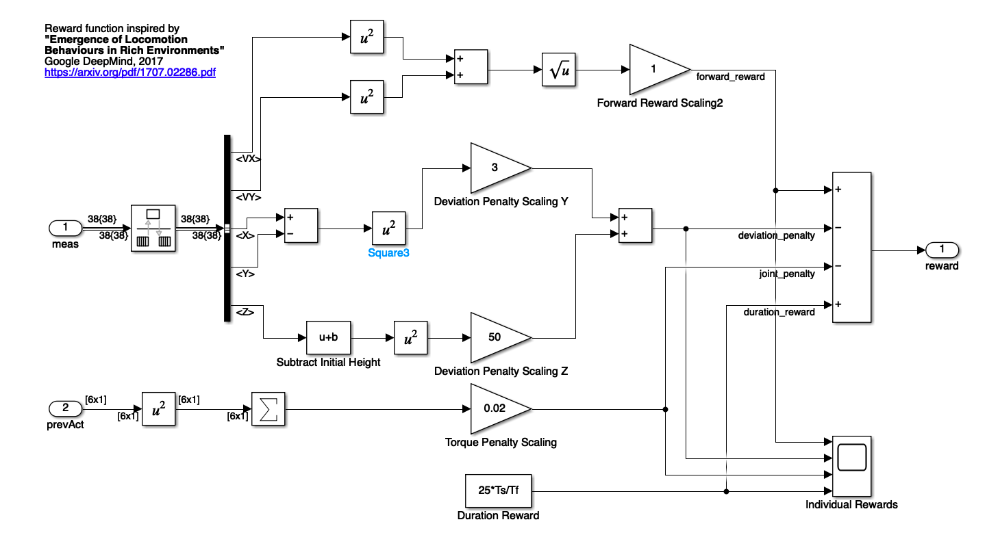

我们希望机器人沿着 $45$ 行走，就等同于希望机器人的 $x$ 轴正方向位移与 $y$ 轴正方向位移的比例是 $1$，因此，如果我们将 **位移之比 $\frac{|X|}{|Y|}$ ** 加入终止条件中，如果这个比例大于 $1.5$ 或者小于 $0.67$ 就直接结束当前 `episode`。

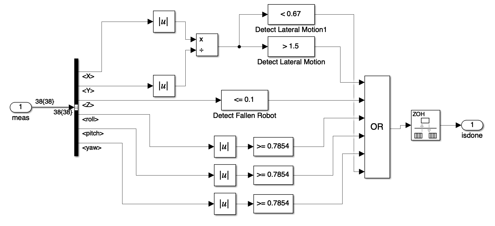

在训练过程中，我们发现每个 `episode` 运行时间太短，猜测是应该是终止条件太过于严格导致的，于是我们又将速度激励前面的比例参数调大尝试增加它前进速度，发现 `step` 更少了，因此决定放宽 $\frac{X}{Y}$ 终止条件至大于等于 $5$ 倍和小于等于 $0.2$ 倍，重新训练。

训练中发现效果比之前有所改善，每个 `episode` 的 `step` 都变长了，但是随着训练的进行仍然会经常出现很少的 `step` 就结束的情况，于是我们猜测是因为在最初几米时由于机器人必定是先向 $x$ 轴移动很大一步，导致触碰到了 $\frac{X}{Y}$ 的比例红线而结束 `episode`。

于是我们对 $X$ 和 $Y$ 的初始情况做个 $\min$ 操作，保证在前面几米的时候不会因为比例不达标而终止 `episode`，实际训练后发现机器人总是会向 $x$ 轴移动一段距离后就终止，这也证实了我这种通过位移比例来限制的想法是不可行的。

所以我们干脆取消了对 $X$ 和 $Y$ 的终止条件限制，并且适当增大了速度激励的比例常数，重新训练。通过训练的曲线看，这次效果前期似乎不错，稳定快速增长，但是后期却无法收敛让我们感到比较迷惑：

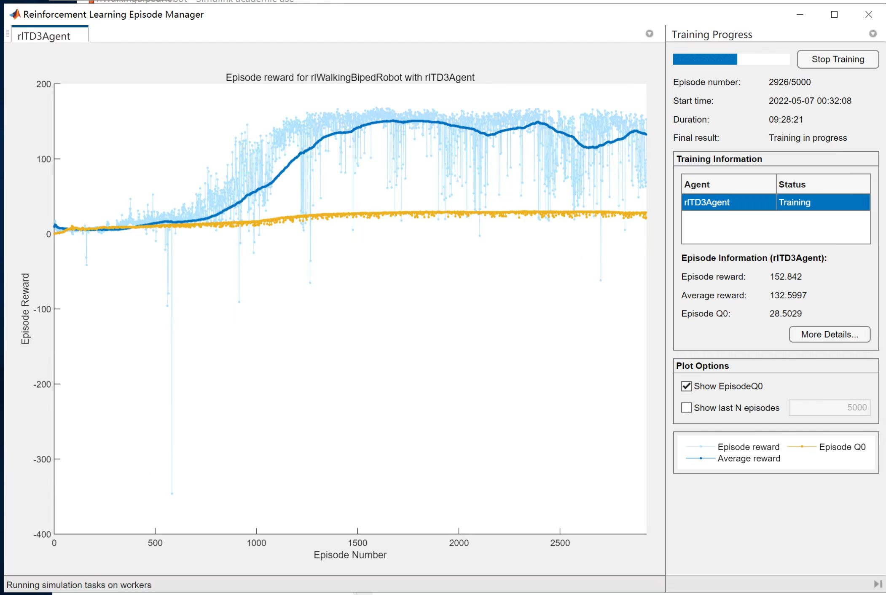

于是我们停止训练并模拟仿真了一下，[斜着走四十五度角.mp4](./README/斜着走四十五度角.mp4)，很意外，我们的机器人竟然在前后摇摆来 **骗取激励**。分析原因发现，这是因为我们在速度激励中没有加入速度的方向，导致来回向前向后运动都可以获得很高的速度激励，于是它就踏上了摇摆之路。虽然这次训练没有达到预期，但这确实挺好玩儿的，也警示我们激励函数的设计要非常严密。

我们于是将速度方向直接加入激励中并适当调整参数，设计奖励函数如下：

$$
r_t = 0.9v_x + 1.1v_y - 0.5|Y - 0.268X| - 50z^2 + 25\frac{T_s}{T_f} - 0.02\sum_i (u^i_{t - 1})^2
$$

训练时发现，在前期时，滞留时间激励相对其他激励不在同一个数量级，需要调整。

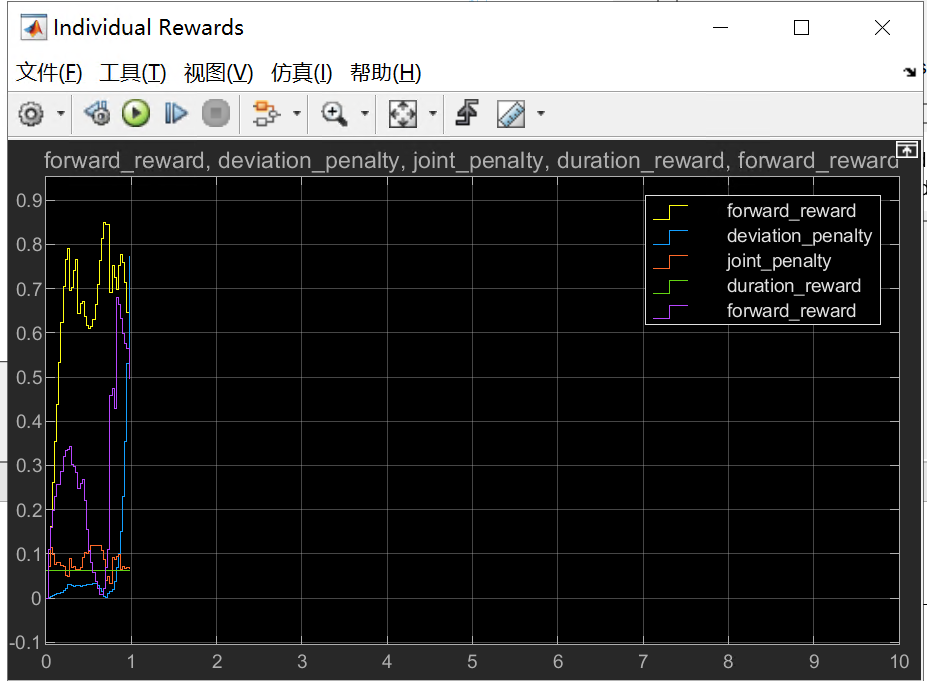

于是我们试图调整滞留时间激励前的比例系数，将其从 $25$ 调整到 $75$，想要让机器人更加持久地行走，瞬间情况就好起来了。我们最终设计的奖励函数是：

$$
r_t = 0.9v_x + 1.1v_y - 0.5|Y - 0.268X| - 50z^2 + 75\frac{T_s}{T_f} - 0.02\sum_i (u^i_{t - 1})^2
$$

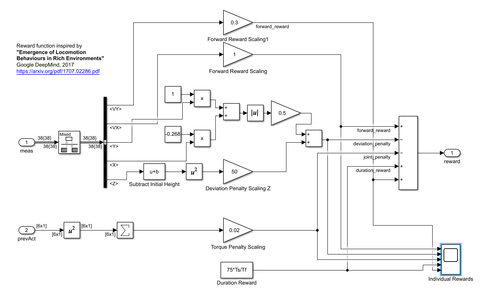

在训练了 $2000$ 个 `episode` 后效果就已经非常显著了，机器人的 `average reward` 稳定在 $200$ 以上，而通过 [走斜线-成功](./README/走斜线-成功.mp4) 视频中我们也可以看到机器人在稳定地向着斜前方走去，至此，我们就完成了机器人走斜线的训练任务。

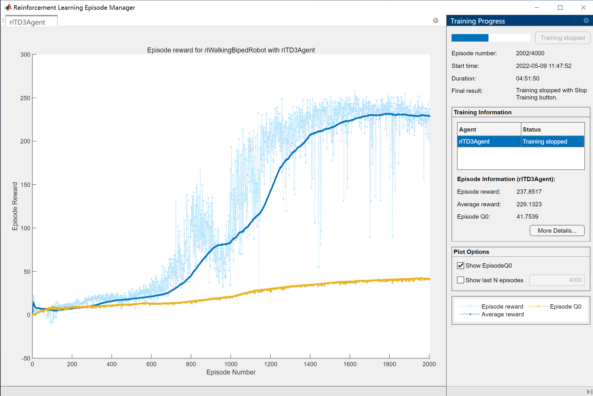

## 走圆圈

经过了这么多次训练，我们好像也掌握了一些门道，就是让机器人按照一个 **固定的行为模式** 做运动会更简单，比如走直线，而走斜线则不是，因为走斜线需要在走路过程中慢慢转角度且到一定角度后又得摆正，所以就不好训练。

于是我们猜测走圆圈或许会更加简单，因为它总是以一个固定的线速度和角速度行走，于是我们简单构造了草图来想激励函数。

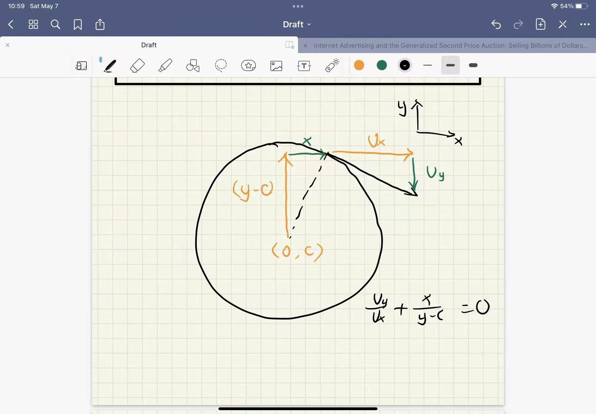

最终确定的激励函数如下：

$$
r_t = \sqrt{v_x^2 + v_y^2} - 3|v_xv_y + v_y(Y + 10)| - 3|X^2 + (Y + 10)^2 - 100|
$$

第一项是 **线速度激励**，第二项是保证它沿逆时针运动的 **方向激励**，第三项则是相对于圆心的 **距离还有速度激励**。

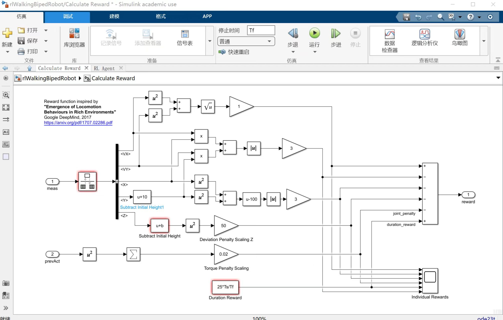

训练了一会发现 `episode reward` 竟然一直都为负数，猜测是某一项惩罚的系数太大了，导致触碰到这个惩罚是 `reward` 就迅速跌入谷底。

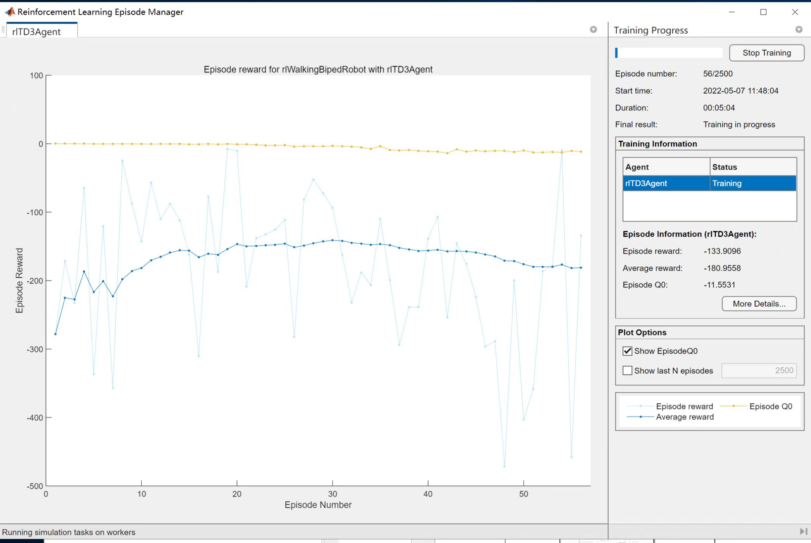

几经调参后，我们的训练依旧没有起色，机器人总是会很快就摔倒，这也让我们意识到设计奖励函数以及调参是很难控制的。最终，在某次参数的调整过后，我们模拟了一下效果 [走圆圈](./README/走圆圈.mp4) 发现机器人像是在很快地直走，很快我们就明白了是因为我们的 **圆半径设置过大**，导致在 `10s` 内只绕着圆心旋转了很小的一个角度，所以看上去像是走直线（切线），想到直线行走都要训练 `2000` 个 `episode` 而且效果还没有特别好，而我们只是训练了 `1700` 个 `episode` 也让它初具走圆圈的形态了，如果调小半径或许能得到更好更直观的结果。

所以我们调小了半径大小，调小了速度以及位移激励的比例系数，并且把滞留时间的激励放大，期望它能绕着圆心多行走一会。经过一段时间的训练，总体趋势是 **稳中向好**，再来看下视频 [走圆圈-1](./README/走圆圈-1.mp4)，发现机器人确实想要围着 $y$ 轴上的圆心绕圈，相信如果继续训练的话应该能够更好，但我们预估如果要训练地比较好至少要训练 $30000$ 个 `episode` 才能开始收敛，所以我们就没有继续训练下去了。

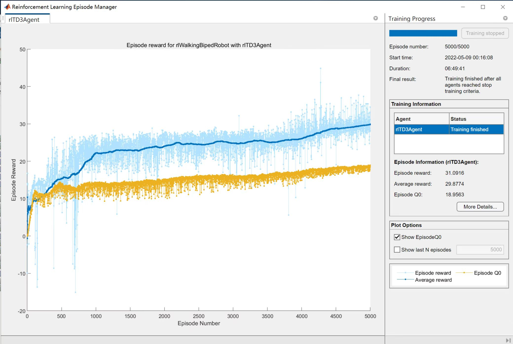

