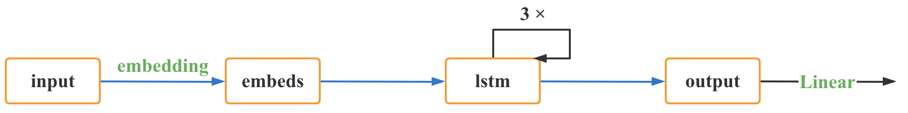

# 电类学科创新前沿导论期末考核

#### name: 徐惠东
#### id: 519021910861

------

### 简答题（80 分，共 16 题，每题 5 分，每题不超过 100 字）。

> 1. 请简述珠穆朗玛峰测高原理。

从珠峰地区日喀则一等水准点起测，将高程传递至珠峰脚下的 6 个交会点，在交会点架设好测量觇标并开始三角高程测量和交会测量。登顶队员需在峰顶架设测量觇标与 6 个交会点联合测量，经过精密的数据处理计算，获得珠峰峰顶高程。

[参考链接](https://www.sohu.com/a/437021895_114988)

> 2. 一个完整的高温超导电缆工程包括哪几个关键零部件，它们分别起到什么作用？

1. **电缆芯**。用于传输电流即导电。
2. **低温容器**。用于装载导电材料并维持适宜环境。
3. **终端**。在超低温下实现电气绝缘并尽可能绝热。
4. **超低温制冷系统**。用于提供超低温环境，以满足超导电缆冷却的最高温度限制和制冷量要求。

[参考链接](https://baike.baidu.com/item/%E9%AB%98%E6%B8%A9%E8%B6%85%E5%AF%BC%E7%94%B5%E7%BC%86/1070831)

> 3. 以实现全自主无人车为例，阐述可能用到哪些视觉感知与定位算法？并分析可能存在的难点。

**视觉感知**：有 **基于双目、多视角图像的三维重构**，**数据驱动的神经网络深度预测** 算法。存在 **图像纹理缺失**，**重复、相似特征**，**大视角变化**，**遮挡** 问题。

**定位**：有 **基于 3D-2D 配准的视觉定位** 算法。存在 **由于视觉变化、光照变化等环境因素造成的图像难以匹配** 问题。

> 4. 以太网是一种有线局域网技术，使用载波侦听与冲突检测 (CSMA / CD) 机制作为其多址接入方式，Wi-Fi 网络被认为是一种无线局域网技术，使用载波侦听与冲突避免 (CSMA / CA) 机制作为其多址接入方式。请简述 (1) CSMA / CD 和 CSMA / CA 两种机制的主要区别。(2) 不能在 Wi-Fi 中直接使用 CSMA / CD 机制的主要原因。

1. **主要区别**：CSMA / CD 主要侦测冲突并进行相应的处理，采用 Stop-when-colliding 机制，适用于以太网。CSMA / CA 主要避免冲突，采用 ACK 机制，适用于无线局域网。

[参考链接](https://blog.csdn.net/lixuande19871015/article/details/78783740)

2. **主要原因**：CSMA / CD 需要同时 **传输** 和 **信道检测**，而无线环境下，天线是单方向的，不能同时发送和接收，因此无法同时检测信道中是否存在冲突。

[参考链接](https://www.zhihu.com/question/42697932)

> 5. 请简述人工智能、机器学习和数据挖掘的概念。

**人工智能**：由机器展示的智能。

**机器学习**：机器针对特定任务通过数据以非显式编程的方式来对某项量化性能指标进行提升的过程。

**数据挖掘**：从海量数据中提取复杂的，隐式的，以前未知且可能有用的原理、模式或知识。

> 6. 请列举你认为未来机器人最重要的五种技术。

**机器人控制技术**、**多传感器技术**、**灵巧控制技术**、**多智能体协调控制技术**、**软机器人技术**。这 5 种技术更加着力于未来机器人的感知与控制，更好地贴合甚至超越了人类现有的能力，因此我认为更加重要。

- 工业机器人操作机结构的优化设计技术。
- 机器人控制技术。
- 多传感器系统。
- 灵巧控制系统。
- 机器人的遥控及监控技术。
- 虚拟机器人技术。
- 多智能体（multi-agent）协调控制技术。
- 微型和微小机器人技术。
- 软机器人技术（soft robotics）。
- 仿人和仿生技术。

> 7. 请简述脑控机器人的工作原理，技术要点以及未来展望。

**工作原理**：人的脑电信号可以反映出人的想法。

**技术要点**：系统通过可穿戴设备采集、放大人脑电波并传输至计算机，计算机通过脑电波来获取人的想法，将其转换成机器人控制指令，再通过无线装置发送给机器人。

**未来展望**：家用、医用、军用都前景广泛，如在医疗领域，可以为残障人士带来生活便利和用作康复训练。

[参考链接](https://baike.baidu.com/item/%E8%84%91%E6%8E%A7%E6%9C%BA%E5%99%A8%E4%BA%BA/10881818)

> 8. 工业互联网中的工业人工智能的来源是什么？数据类型有哪些？有哪些特性与商业人工智能有所不同？主要用途是哪些？

**来源**：人工智能辅助和数据驱动型规划、生产、制造和维护。

**数据类型**：电流，电压，温度，振动，视觉等。

**不同点**：可解释性不同（白盒），安全要求不同（零容忍），可靠性要求不同（极高），数据源不同（数据样本较小）。硬件不同（工业级）。

**主要用途**：参数寻优，预测性维护，缺陷检测等。

> 9. 简述这轮人工智能，算法，算力，数据的重要性，请用水壶倒水的类别来解释。

人工智能需要运用算法对数据进行大规模运算，而计算的快慢便是算力。

以水壶倒水为例，数据量大小就像是水壶里水的多少（即原材料的量），算法的好坏就像是水杯的大小（即信息承载能力），而出水的快慢就是算力（即计算的速度能力）。

> 10. 简述人机交互设备 (Human-Machine Interface) 中的触觉感知 (Haptic Perception) 定义、分类和内涵特征。

**触觉感知定义**：人机交互设备为用户提供的触摸虚拟物体的触觉体验（如压力、温度等）。

**分类**：操纵型，手指抓取型，外骨骼型。

**内涵特征**：汇集来自不同设备、不同数据源和不同感知实体的信息，通过处理这些多元数据信息来更全面地感知物理世界，为人类提供精准和智能的服务。

[参考资料](http://www.ccm.media.kyoto-u.ac.jp/~yu/HMI.pdf)

> 11. 2021 年 6 月，我国《数据安全法》正式出台，标志着我国在网络与信息安全领域的法律法规体系得到了进一步的完善。新法案按照总体国家安全观的要求，对数据安全做出了全面的指导，提出对数据要进行分类分级保护制度。请说明出于保护的目的，如何进行数据分类和分级，即分类和分级的依据。

根据《数据安全法》第二十一条，我国建立数据分类分级保护制度，**根据数据在经济社会发展中的重要程度，以及一旦遭到篡改、破坏、泄露或者非法获取、非法利用，对国家安全、公共利益或者个人、组织合法权益造成的危害程度**，对数据实行分类分级保护。

> 12. 请给出虚拟现实的定义，列出虚拟现实的三个主要特点，并阐述你对这三个特点的理解。

**虚拟现实定义**：由计算机生成的虚拟世界，展现给人的多个感知通道。

**虚拟现实特点与理解**：

1. **沉浸感。**通过视觉、听觉等人类感知营造身临其境感觉，让人仿佛置身其中。
2. **交互性。**虚拟世界中的事物为我所动，我能像现实世界中一样与它们交互并获得反馈。
3. **想象力。**虚拟世界中敢想的事情都可能发生，不受现实世界中物理规律、化学规律的限制。

> 13. 从通信资源扩张的角度，简述移动通信代际演进的技术路线。

第一代使用 **模拟 + 频分** 技术在 **时间域** 演进，第二代使用 **GMSK + TDMA** 技术在 **时间域** 上进一步演进，第三代使用 **QAM + CDMA + 智能天线** 技术在 **码域** 和 **空间域** 上演进，第四代使用 **QAM + OFDM+ MIMO** 技术在 **频率域** 上演进，而第五代则使用 **QAM + OFDM + NOMA + 毫米波 + MASSIVE MIMO + 密集蜂窝小区** 技术在 **物联网** 和 **边缘网** 上演进。

> 14. 人体的主要导航器官？各自的导航功能？

**眼睛** 和 **前庭系统** 和 **大脑** 是人体的主要导航器官。

**眼睛** 主要用于视觉导航，接收外部视觉信息并传入大脑。**前庭系统**主要用于惯性导航，负责人体自身平衡感和空间感，接收外部惯性信息并传入大脑。**大脑** 则对传入的惯性和视觉信息进行融合计算。

> 15. 简述使光纤通信系统的容量和距离大幅提升的主要关键技术并解释原理。

**波分复用系统 (WDM)** ：利用多个激光器在单条光纤上同时发送多束不同波长激光的技术。每个信号经过数据（文本、语音、视频等）调制后都在它独有的色带内传输。

[参考资料](https://zh.wikipedia.org/wiki/%E6%B3%A2%E5%88%86%E5%A4%8D%E7%94%A8)

**掺铒光纤放大器 (EDFA)** ：在单模石英光纤中掺入微量的铒离子，注入泵浦光使三价铒离子的亚稳态能级 $^2I_{13/2}$ 与基态 $^2I_{15/2}$ 能级发生粒子数布居反转，从而在 1550 nm 的信号光通过时发生受激辐射将信号光放大的器件。

[参考资料](https://zh.wikipedia.org/wiki/%E6%8E%BA%E9%93%92%E5%85%89%E7%BA%A4%E6%94%BE%E5%A4%A7%E5%99%A8)

> 16. 请简述蜂拥 Reynolds 模型三原则？

- **分离**。即个体与邻域内的智能体要避免相撞，是 **相互排斥** 思想的体现。
- **聚合**。即个体与邻域内的智能体要保持紧凑，是 **相互吸引** 思想的体现。
- **速度匹配**。即个体与邻域内的智能体速度要保持一致。

### 论述题（20 分，共 2 题）。

> 1. 挑选课程中你最感兴趣的一个方向，结合文献阅读（至少一篇），说说自己开展研究的想法及计划。

#### 简介

**人工智能** 是我最感兴趣的方向，本篇小论文基于知网论文 [《人工智能“为你写诗”》](https://kns.cnki.net/kcms/detail/detail.aspx?dbcode=CJFD&dbname=CJFDLAST2019&filename=DKJS201801014&uniplatform=NZKPT&v=w6juhFieqlTlFGtAkt_e2d7nDW5w1iEep9EGgcUxi9Ax8lK4XiIcm624oA-o2-u7) 而创作，包含了对 AI 写诗现状的简要分析和 AI 写诗的简单代码实现以及未来展望等内容。

诗歌自古以来就是中华传统文化的掌上明珠，当诗歌碰上人工智能，会摩擦出怎样的火花呢？因此，为了更加深入探究 AI 在写诗方面的应用，我参考了《Pytorch 入门与实践》教程和 [GitLab 上开源代码框架](https://gitee.com/wannabe-9/LSTM_poem1) 上开源代码框架，采用 [**循环神经网络 (RNN)**](https://zh.wikipedia.org/wiki/%E5%BE%AA%E7%8E%AF%E7%A5%9E%E7%BB%8F%E7%BD%91%E7%BB%9C) 中的 [**长短期记忆 (LSTM)**](https://zh.wikipedia.org/wiki/%E9%95%B7%E7%9F%AD%E6%9C%9F%E8%A8%98%E6%86%B6) 模型进行训练，最终效果可以支持 **首句续写** 和 **藏头诗** 两种功能，并且实现了基本的音律和意境。

**关键词**
深度学习  循环神经网络  长短期记忆  预训练模型

#### 技术栈

**长短期记忆 LSTM**

LSTM 全称是 Long Short Term Memory，是具有记忆长短期信息的能力的神经网络。它的提出是为了解决传统的 RNN 东东长期依赖问题。

LSTM 的工作原理主要分为 **遗忘**，**存储**，**更新** 和 **输出** 这四个主要步骤，通过前向传播进行参数更新，通过反向传播进行误差纠正。

本项目中 LSTM 主要运用来训练古诗数据，架构如下。

首先我们将数据集喂给模型作为 _input_，经过 _embedding_ 预处理得到 _embeds_ 层，然后经过 _LSTM_ 进行训练得到 _hidden_ 层和 _output_ 层，最后经过 _Linear_ 层判别，然后反相传播并循环训练即可。

**深度学习**

深度学习是机器学习中一种基于对数据进行表征学习的算法，能够用非监督式或半监督式的特征学习和分层特征提取高效算法来替代手工获取特征。

**循环神经网络 RNN**

循环神经网络是一类以序列数据为输入，在序列的演进方向进行递归且所有节点（循环单元）按链式连接的递归神经网络，在对序列的非线性特征进行学习时具有一定优势

**预训练模型**

使用尽可能多的训练数据，从中提取出尽可能多的共性特征，从而能让模型对特定任务的学习负担变轻。之后还可以进行微调，可拓展性高。

#### 代码解释

本模型使用 Pytorch 框架，在 Google 的 Colab 平台上完成模型训练。实现了 **首句生成** 和 **藏头诗** 两个功能，现在全部代码已经开源至 [GitHub](https://github.com/WilliamX1/AI-poet)。

在 **首句生成模式** 中，我们优先使用风格前缀生成隐藏层，并结合用户输入的首句喂给预训练模型生成下一句，再使用生成的下一句作为下一次迭代的输入，不断迭代直至达到最大生成字数或遇到终止符 \<EOP\> 为止。

在 **藏头诗模式** 中，我们同样优先使用风格前缀生成隐藏层，并结合用户输入每次喂给模型一个字作为开头并续写，迭代更新至用户输入用完为止。

#### 运行展示

**首句生成**

> 草色青青柳色黄，紫梨花谢春风开。
> 江水东流无社稷，君王朝日如冬霜。
> 白头老少今何幸，每见知君心不伤。

"草⾊青青柳⾊黄" 摘选⾃唐代诗⼈贾⾄的《春思》，原诗通过描写春草、柳树、桃花、李花等 景⾊，借⽤东风、春⽇表达作者⼼中的愁绪和苦闷之情。

本模型则借助梨花、春风等景⾊，表达出古代君王⼀事⽆成悲叹万分的⼼境，最后⼀句更是感慨年华易逝，劝解年轻⼈珍惜青葱岁⽉。虽然与原诗不尽相同，但⽆论从意蕴、韵脚等⽅⾯都颇具形态。

------

**藏头诗模式**

> 爱君古贤者，饮造古太平。
> 国有圣贤⼦，⽔有帝王城。
> 荣名贵相府，思国势不平。
> 校奉两仪⾎，源厉万姓名。

这⾸诗歌以交⼤校训 "饮⽔思源，爱国荣校" 为藏头部分，通过描写古代圣贤开明的君主治理社会井井有条，以及百姓思念这样贤明的君王，是对校训中 "感恩" 精神的完美诠释。

------

**不使用风格**

> 红藕⾹残⽟簟秋，鸳鸯⼀卷掩玲旌。
> ⼀声清晓起秋⽉，万籁千声惹九秋。

在给出⾸句且不使⽤风格的情况下，全诗通过描写鸳鸯、清晓秋⽉等景物，动静结合，渲染出⼀个完整的秋天模样。

------

**使用风格 "八百里分麾下炙，五十弦翻塞外声"**

> 红藕香残玉簟秋，风吹雨洒江楼席。
> 忆昔湖畔选旅人，今年战士归江上。

风格语句摘选自南宋词人_辛弃疾_的《破阵子·为陈同甫赋壮词以寄之》，通过创造雄奇的意境，生动地描绘出一位披肝沥胆、忠一不二、勇往直前的将军形象，同时也表达了杀敌报国、收复失地的理想。

本模型通过描写了在湖畔边追忆旅人，今年征战沙场的将士将从江上归来，抒发了雄心壮志的英雄气概，与原风格非常契合。

------

#### 总结

受到百度的人工智能写诗论文的启发，我更加深入地完成了这个简单的 **AI 写诗** 的玩具模型，亲自训练并体验完整的开发流程让我对人工智能写诗的了解更加深入。

尽管人工智能目前还不能够完全 “理解” 人类的情感，因此现阶段也无法达到顶级诗人的水平。但我相信，在未来的大数据、高算力和好算法的帮助下，人工智能将会迎来全新的高度，在作诗的领域终有一天会超过人类。

> 2. 对本课程的建议。

带着了解科技前沿的想法来到了这门课程的课堂，听到了 16 位老师的精彩报告，让我对当今世界上前沿的技术有了初步的了解，所以这门课程我并没有什么遗憾。

要说建议还是有的，具体分为以下几点。

- **改善课程内容，提高教学质量。**考虑到这门课同学来自不同学院不同年级，因此各自的学科基础具有较大差别，所以我认为这门课的定位应该更偏向于科普性、导论性，教学内容可以更偏向于普及前沿的技术概况而不需要深入细节，比如一些公式推导等细节性的内容不必讲解，可以适当多关注一些某个技术的前沿应用场景。
- **实验室介绍可以更加深入。**我是怀揣着了解电院的一些实验室的目的来上这门课的，我觉得部分高年级同学也有类似的目的想法，所以可以适当增加老师所在实验室的介绍，例如实验室重点研究的内容等，这样不仅可以满足高年级同学的找实验室的迫切需求，也让低年级同学对实验室进行的工作有了初步的认识，为之后的课程学习和研究方向确定都有一定作用。

