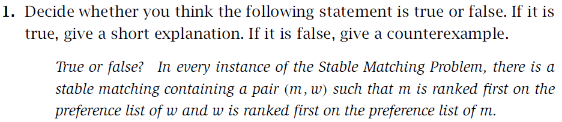
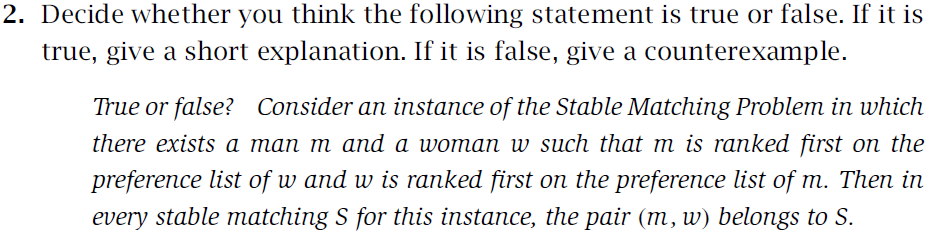
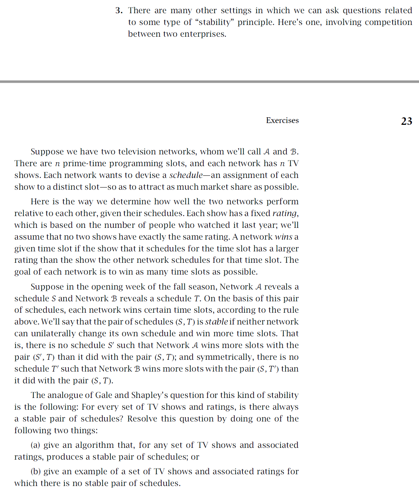
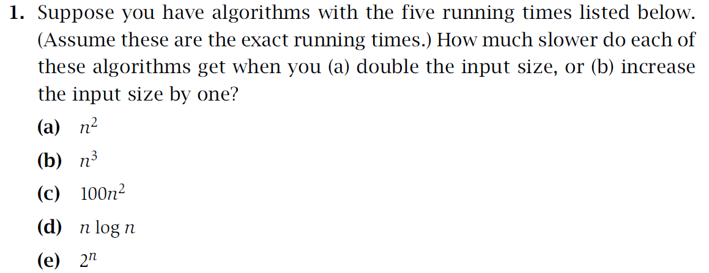
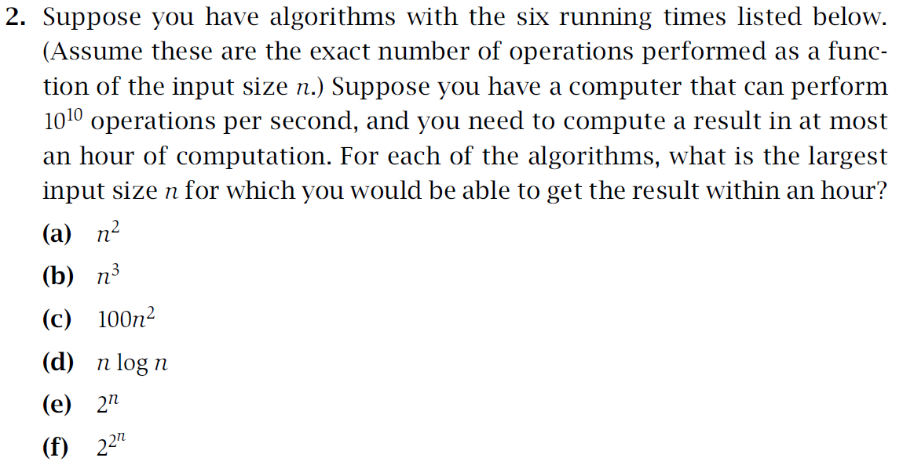
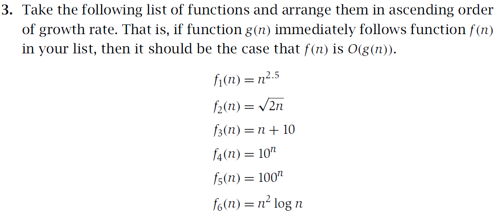
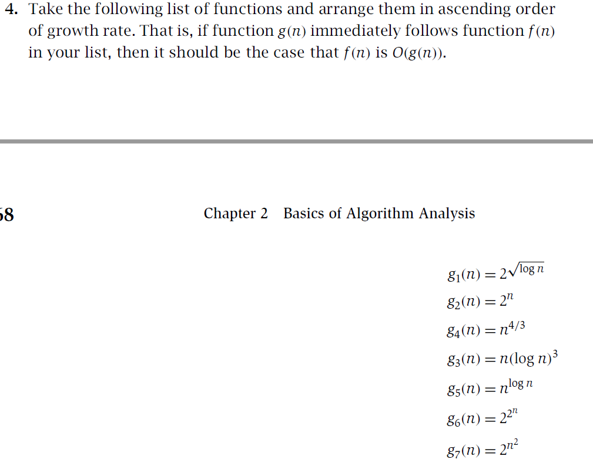
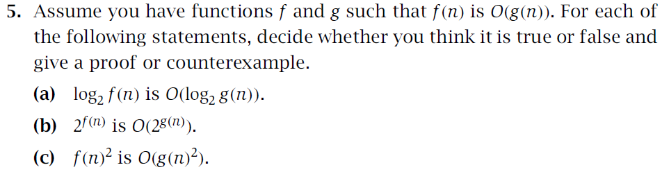
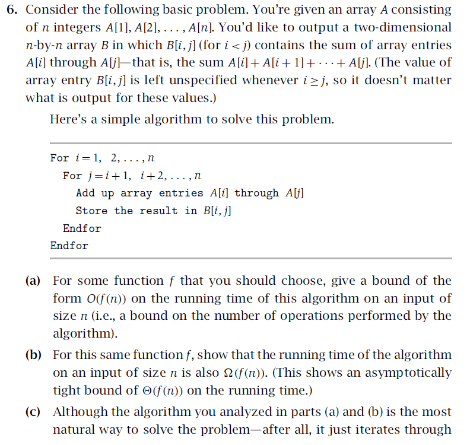
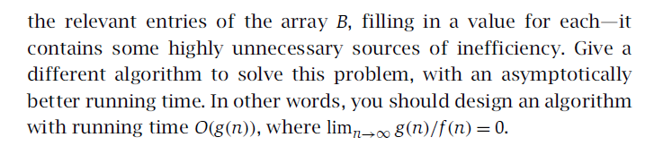

## Assignment 1
#### id: 519021910861
#### name: huidongxu
-------
```date: 2021-9-22	2021-9-25```

### 1-1


False. It's obvious this is false, let's construct a condition to explain why.

For anyone in this condition, the person (A) who is ranked first on the preference list of him doesn't rank him first on it's (A) preference list. And this condition can be the Stable Matching Problem.

ex. Suppose m prefer w' to w, m' prefer w to w', w prefer m to m', w' prefer m' to m. One of the stable matching set is (m, w')、(m', w), where the men get their first ranked women and the women get their last ranked men at the same time.

### 1-2


True. Let's use proof by contradiction to prove it's true.

Suppose there exists a stable matching S', where (m, w) doesn't belong to it. So there must exist m'(not equal to m), w'(not equal to w) where (m', w) and (m, w') belong to S'. According to the problem set, m is ranked first on the preference list of w and w is ranked first on the preference list of m, that is, m prefer w to w' and w prefer m to m'. So (m, w) is the instability in S', contradicting the claim that S' is stable and hence contradicting our initial assumption.

### 1-3


There is not always a stable pair of schedules for this kind of stability. This is like Tian Ji's strategy for a horse racing. Let's take a counter-example to explain it.

ex. Suppose for television network A, the fixed rating of its two shows are 1% and 3% respectively. While for television network B, the fixed rating of its two shows are 2% and 4%. It's obvious A can win at most 1 slot and B can win at most 2 slots, which is contradictory. More specifically, in the condition of (A:1%, B:2%)、(A:3%, B:4%), A can change its schedule to get better performance. And in the condition of (A:1%, B:4%)、(A:3%, B:2%), B can change its schedule to get better performance.

As a result, there is no stable pair of schedules in this situation, indicating that there is not always a stable pair of schedules for every set of TV shows and ratings.

### 2-1


**将输入规模加倍**
1. 运行时间将以 $3n^2$ 增加。
$$
\Delta = (2n)^2 - n^2 = 4n^2 - n^2 = 3n^2 = O(n^2)
$$
2. 运行时间将以 $7n^3$ 增加。
$$
\Delta = (2n)^3 - n^3 = 8n^3 - n^3 = 7n^3 = O(n^3)
$$
3. 运行时间将以 $300n^2$ 增加。
$$
\Delta = 100(2n)^2 - 100n^2 = 400n^2 - 100n^2 = 300n^2 = O(n^2) 
$$
4. 运行时间将以 $nlog(n) + 2n$ 增加。
$$
\Delta = (2n)log(2n) - nlog(n) = nlog(n) + 2n = O(nlog(n))
$$
5. 运行时间将以 $(2^n - 1) \times 2^n$ 增加
$$
\Delta = 2^{2n} - 2^n = (2^n - 1) \times 2^n = O(2^n)
$$

**将输入规模增加 1**

1. 运行时间将以 $2n + 1$ 增加。
$$
\Delta = (n + 1)^2 - n^2 = (n^2 + 2n + 1) - n^2 = 2n + 1 = O(n)
$$
2. 运行时间将以 $3n^2 + 3n + 1$ 增加。
$$
\Delta = (n + 1)^3 - n^3 = (n^3 + 3n^2 + 3n + 1) - n^3 = 3n^2 + 3n + 1 = O(n^2)
$$
3. 运行时间将以 $200n + 200$ 增加。
$$
\Delta = 100(n + 1)^2 - 100n^2 = 100(n^2 + 2n + 1 - n^2) = 200n + 200 = O(n) 
$$
4. 运行时间将以 $log(n + 1)$ 增加。
$$
\Delta = (n + 1)log(n + 1) - nlog(n) = nlog(n + 1) - nlog(n) + log(n + 1) \approx log(n + 1) 
$$
5. 运行时间将以 $2^n$ 增加
$$
\Delta = 2^(n + 1) - 2^n = 2 \times 2^n - 2^n = 2^n = O(2^n) 
$$

### 2-2


**$$ T = 10^{10} \times 60 \times 60 = 3.6 \times 10^{13} $$**
**所以以下操作不能超过 $10^{13}$ 次即可以在一小时内获得结果。**

$$
1. \quad n^2 =  3.6 \times 10^{13} \Rightarrow n = 6 \times 10^6
$$
$$
2. \quad n^3 =  3.6 \times 10^{13} \Rightarrow n = 36^{1/3} \times 10^4 \approx 3.3 \times 10^4
$$
$$
3. \quad 100n^2 =  3.6 \times 10^{13} \Rightarrow n = 6 \times 10^{5}
$$
$$
4. \quad nlog(n) =  3.6 \times 10^{13} \Rightarrow n \approx 10^{12}
$$
$$
5. \quad 2^n = 3.6 \times 10^{13} \Rightarrow n = 45
$$
$$
6. \quad \quad 2^{2^n} = 3.6 \times 10^{13} \Rightarrow n \approx 5.49
$$

### 2-3


$$
\sqrt{2n} \leq n + 10 \leq n^2log(n) \leq n^{2.5} \leq 10^n \leq 100^n 
$$

$$
f_2 \leq f_3 \leq f_6 \leq f_1 \leq f_4 \leq f_5 
$$
### 2-4


**全部取对数即可比较**
$$
2^{\sqrt{log(n)}} \leq n(log(n))^3 \leq n^{4/3} \leq n^{log(n)} \leq 2^n \leq 2^{n^2} \leq 2^{2^n}
$$

$$
g_1 \leq g_3 \leq g_4 \leq g_5 \leq g_2 \leq g_7 \leq g_6
$$

### 2-5


1. 假。反例如下：
若 $f(n) = 2$ 且 $g(n) = 1$，对于任意 $c$， $logf(n) = log(2) = 1 \leq c \times log1 = 0$ 均不成立。

2. 假。反例：
若 $f(n) = 2n$ 且 $g(n) = n$ ，则 $2^{f(n)} = 4^n$ 且 $2^{g(n)} = 2^n$，则不存在常数 $c$ 和 $n_0$，使得当 $n \geq n_0$ 时，$4^n \leq c \times 2^n$ 均成立。

3. 真。证明如下：
**证**：已知对于某个常数 $c$ 和 $n_0$ ，对所有 $n \geq n_0$ ，我们有 $f(n) \leq c \times g(n)$ 。不妨设 $h = f(n)^2$ ，有：
$$
h = f(n)^2 \leq (c \times g(n))^2 = c^2 \times g(n)^2
$$
则对于 $c^{'} = c^2$，对于任意 $n \geq n_0$ ，有：
$$
h \leq c^2 \times g(n)^2 = c^{'} \times g(n)^2
$$
所以 $h = f(n)^2$ 是 $O(g(n)^2)$ 。


### 2-6



1. 由于需要计算 $B[i, j] $ 且 $i \leq j \leq n$ ，所以共需要计算 $n \times (n + 1) / 2$ 个$B[i,j]$，而每次计算都是$A[i] + A[i + 1] + ... + A[j - 1] + A[j]$，所以共需要：

$$\begin{aligned}
\sum_{i = 1}^{n}\sum_{j = i + 1}^{n}\sum_{k = i}^{j} 1 &= \sum_{i = 1}^{n}\sum_{j = i + 1}^{n}(j - i) \\
&= \sum_{i = 1}^{n}((n - i + 1) \times (n - i) / 2 \\ 
&= 1/2 \times (\sum_{i = 1}^{n}(n^2 + n + i^2 - 2n \times i - i)) \\
&= 1/2 \times (n^3 + n^2 + n \times (n + 1) \times (2n + 1) / 6 - 2n \times n \times (n + 1) / 2 - n) \\
&= (2n^3 + 3n^2 - 5n) / 6 \\
\end{aligned}$$
对于常数 $c = 1$ ，对于任意 $n \geq 100$ ，恒有：
$$
(2n^3 + 2n^2 - 5n) / 6 \leq (2n^3 + 3n^3) / 6 \leq 3n^3 / 6 = 1/2 n^3
$$
所以该算法在规模为 $n$ 的输入上的 $O(f(n))$ 的界是 $O(n^3)$ 。

2. 由（1）可知，本算法操作数量为 $(2n^3 + 3n^2 - 5n) / 6$，因此对于常数 $c = 1$ ，对于任意 $n \geq 100$ ，恒有：
$$
(2n^3 + 2n^2 - 5n) / 6 \geq (2n^3 + 2n^2 - n^2) / 6 = (2n^3 + n^2) / 6 \geq (2n^3) / 6 = 1/3 n^3
$$
所以该算法在规模为 $n$ 的输入上的运行时间也是 $\Omega(f(n))$ 。

3. 利用前缀和思想，先将数组 $A$ 不断累加，然后对于数组 $B$ 待求的每个元素，直接进行简单的加减法即可得到，时间复杂度为 $O(n^2)$
```C++
0 -> C[0]
For i = 1, 2, ..., n
	C[i] = C[i - 1] + A[i] /* 计算前缀和 */
For i = 1, 2, ..., n
	For j = i + 1, i + 2, ..., n
		B[i, j] = A[j] - A[i - 1]
	Endfor
Endfor
```


