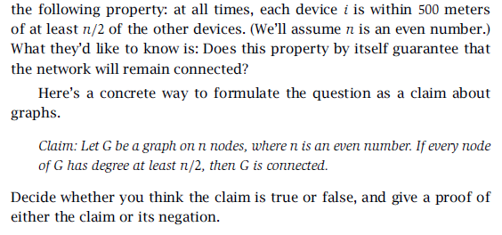

## Assignment 1
#### id: 519021910861
#### name: huidong xu
------
```date: 2021-10-12```

### 3-2

检测一个无向图是否有环，即检测这是否是一颗树，但由于增加了要求：如果有环就要输出其中任意一个环，所以我选用 DFS 算法，从任一节点开始，深度搜索它的相邻节点，并增加一个集合记录节点是否被遍历过。如果遍历某节点时发现该节点已经被遍历过一次，则回溯输出这条带环路径。由于该算法最多只会遍历 n 个节点和 m 条边，所有时间复杂度为 O(m + n)。具体算法伪代码如下：

```C++
set<node> isTraverse <- empty
size <- the number of nodes
_find(node root, vector<node>& v)
	/* 如果全部结点都已经被遍历过一次则返回 false */
	if isTraverse.size == size: return false
	/* 如果当前节点已经在遍历集合中则找到该环 */
	if root is in isTraverse:
		return true
	/* 将当前节点加入遍历集合中 */
	isTraverse.add(root)
	v.push_back(root)
	/* 如果当前节点的相邻节点还有没有被遍历过的 */
	while some node adjacent to root is not in isTraverse:
		node cur <- choose one of these nodes
		if (_find(cur, v) == true) return true
	/* 还原 vector 状态*/
	v.pop_back()

main:
	vector<root> v <- empty
	if find(root, v) == true: return v;
	else return false
		
```
### 3-4


检测 m 条语句是否会造成冲突，由于语句会宣称两个节点是一致的或相异的，所以我们可以以此为依据构造图，“一致性”语句中两个节点即连通，“相异性”语句中某个节点放在另外一个图中，随后判断是否会有语句造成冲突。简单起见，我们可以用并查集来表示这两个子图，具体实践中可以直接更换成两个集合来表示两个子图中的结点。由于算法最多会遍历 n 个节点的 m 条边，所以算法复杂度为 O(m + n)。具体算法伪代码如下：

```C++
set<node> A <- empty, B <- empty
set<judgement> isAssure <- empty
size <- the number of judgements
while isAssure.size != size:
	choose one of judgement as the begining:
		node_a, node_b <- two different nodes of judgement_i
		/* 将这条语句的两个节点根据语义随机分配到 set 中 */
		if judgement_i is "same":
			A.add(node_a); B.add(node_b);
		else if judgement_i is "different":
			A.add(node_a); B.add(node_b);
	if isAssure.size == size: return true
	
	flag <- false /* 记录本次过程中是否有语句被确认 */
	do:
		judgement_i <- one of judgements not in isAssure
        node_a, node_b <- two different nodes of judgement_i
        if judgement_i is "same":
            /* 如果两个节点在相异的图中 */
            if node_a is in A && node_b is in B: return false
            if node_a is in B && node_b is in A: return false
            /* 集合具有唯一性，所以重复添加不影响结果 */
            if node_a is in A: A.add(node_b), flag = true
            else if node_a is in B: B.add(node_b), flag = true
            else if node_b is in A: A.add(node_a), flag = true
            else if node_b is in B: B.add(node_a), flag = true
            /* 如果两个节点都还不在集合中，则等待 */
            else continue
        else if judgement_i is "different":
            /* 如果两个节点在相同的图中 */
            if node_a is in A && node_b is in A: return false
            if node_a is in B && node_b is in B: return false
            /* 将两个节点添加到不同的图中 */
            if node_a is in A: B.add(node_b), flag = true
            else if node_a is in B: A.add(node_b), flag = true
            else if node_b is in A: B.add(node_a), flag = true
            else if node_b is in B: A.add(node_a), flag = true
            /* 如果两个节点都还不在集合中，则等待 */
            else continue
        while (flag)
        
return true
```

### 3-7


正确。反证法。假设图中有 n 个节点，n 大于等于 2 且是偶数。不妨取任一节点记为 node_a，则该节点将与图中另外 n / 2 个节点连通，即由 1 + n / 2 个节点是连通的。假设存在某个节点不与上述 1 + n / 2 个节点连通，根据题设：每个节点都需要有 n / 2 个连通节点，又剩余的节点数量是$ n - (1 + n / 2) - 1 = n / 2 - 2 \lt n / 2$，与题设矛盾。故假设不成立。结论是正确的。

```date: 2021-10-15```

### 4-1


真。交换论证。假设不存在包含边 e\* 的 G 的最小生成树，则对于 G 的任意一棵最小生成树，边 e\* 的两个顶点 u 和 v 将通过另外一条路径连接。我们将 e\* 添加到这棵最小生成树中，则构成了一个包含有 u 和 v 的环，所以我们去除这个环上任意一条除 e\* 的边，既不会改变这棵树的连通性也不会增加这棵树的开销，即这个含有 e\* 的边的生成树也是一棵最小生成树，故结论得证。

### 4-8

易证，图 G 中权值最小的边一定是最小生成树的边。（否则最小生成树加上权值最小的边后构成一个环，去掉环中任意一条非此边则形成了另一个权值更小的生成树）
设 T，T' 为 G 的俩个最小生成树，设 T 的边集 E(T) = {e1, e2, ... , em}, T' 的边集 E(T') = {e'1, e'2, ..., e'm}。设 ek 满足 ek != e'k 且 k 最小，由于所有边权值不同，不妨假设 weight(ek) < weight(e'k)，则将 ek 加入到 T'，T' 中构成环，易知环中不包含 e'1, e'2, ..., e'k-1（否则在 T 中有包含 ek 的环），将环中任意非 ek 边删除后得到了权值更小的生成树，这与 T' 为最小生成树相矛盾，故 G 最小生成树唯一。

### 4-9

两个结论均不成立。如下图：
最小瓶颈生成树边的权值分别是 4-4-1。
而最小生成树边的权值分别是 5-1-1。


### 4-29

我们可以结合贪心算法和深度优先算法来进行查询。首先将该列表从大到小进行排序，维护两个集合，集合 S 用于记录已经选择的点，集合 S' 用于记录不能被选择的点，初始化 S 和 S' 均为空。取出列表第一个值 n（即当前最大值），从图 G 中选择出每个度数大于等于该值的点集，并每次从中选出一个点进行计算。对选出的点的 m 条边，每次挑出 n 条边，将这些边所连接的点加入集合 S 中，并将其他边所连接的点加入集合 S'。之后每次搜索都从集合 S 中挑出度数满足条件的点进行操作，如果在搜索过程中无法选出这样的点，则回溯。如果在搜索过程中整个列表被遍历完成，则存在这样的无向图，否则不存在。


