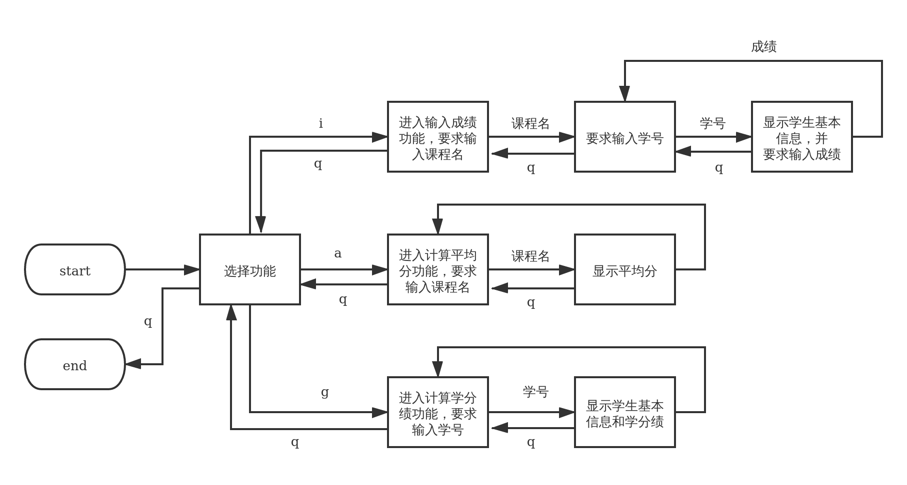
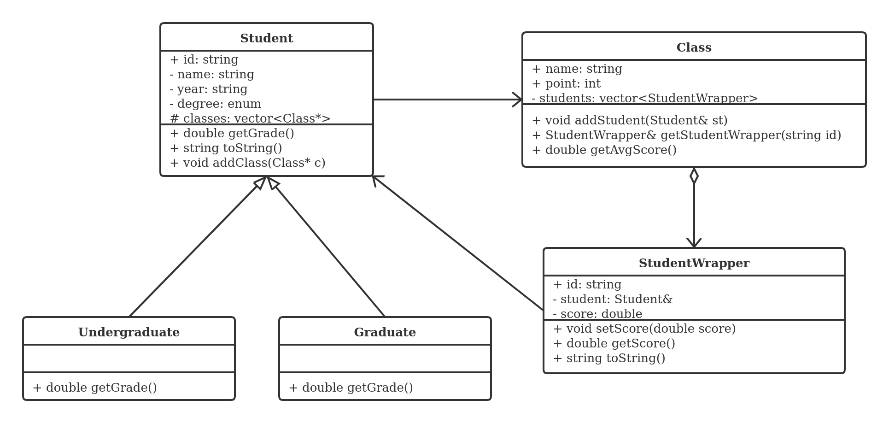

# Lab1: X老师的小程序

[toc]

X老师需要一个统计和计算学生成绩的小程序，以协助他录入学生成绩、计算课程均分以及查看学生的学分绩。
学生名单、课程列表和学生的选课情况已经存在于文本文件中，小程序需要从这些文件中读出内容并建立相应的对象，以完成后续的成绩录入和计算工作。

学生名单存在于文件 `Students.txt` 中，其中学生分为本科生（Undergraduate）和研究生（Graduate），分别以字母 `U` 和 `G` 表示，文件格式如下（`#` 开头的是注释）：

```
# id;name;year;degree
F180370001;Apple;2019;U
B180370010;Boy;2018;G
```

课程列表和学生选课情况存在于文件 `Classes.txt` 中，文件每一段表示一个课程和选择该课程的学生学号列表，格式如下（`#` 开头的是注释）：

```
# Class name and points followed by student ids
Class:ICS
Points:5
F180370001
F180370002

Class:English
Points:3
F180370003
B180370001

Class:ADS
Points:2
B180370001
B180370002
```

小程序需要实现的功能主要有以下三个：

1. 记录成绩：记录某一门课程的一名学生的成绩，为了简便该程序不要求将成绩写入文件，只需存储在内存中即可。
2. 计算课程平均分：在成绩录入完成以后，选择一门课程并计算出该课程所有选课学生的平均分。
3. 计算学生学分绩：在成绩录入完成以后，选择一名学生并计算 ta 的学分绩。其中本科生和研究生的学分绩计算方法不同，本科生的总学分绩是 5.0，计算方法是每门课程的分数除以 20 然后按照学分数量加权平均；研究生的总学分绩是 4.0，计算方法是先分档次记分：90～100分 => 4.0，80～89分 => 3.5，70～79 => 3.0，60～69 => 2.5，60以下 => 2.0，然后再按照学分数量加权平均。

小程序通过命令行与用户进行交互，用户通过输入一些特定的命令、课程名、学号和成绩来完成操作流程，流程图如下：



在系统设计中，类的关系要求如下：



其中 `getGrade` 函数是 `Student` 类的**纯虚函数**，它的子类 `Undergraduate` 和 `Graduate` 继承后具体实现了 `getGrade` 函数。（图例可参考：https://en.wikipedia.org/wiki/Class_diagram）


## 任务

1. 小程序的部分代码已经给出，现在需要你将其补全（即解决所给代码中所有的 `TODO`）: 

   1. 从 `Classes.txt` 文件中课程列表和学生选课情况，将其创建成对应的对象；
   2. 实现 `Student` 类、`Undergraduate` 类和 `Graduate` 类；
   3. 完成计算课程平均分功能、记录成绩功能和计算学生学分绩功能。
2. 所给代码中 `StudentWrapper` 类的构造函数是有错误的，请改正这个错误**详细**说明原因（创建一个新的 `BugReport.txt` 文本文件进行说明）。
3. 处理程序异常输入，例如输入不存在的课程名、学号或者无效的分数时程序不应该崩溃（提示：考虑使用`try...catch`）。


## 提交

注意，作业的完成包括两部分：

1. 在完成后，需要在上机课时找到助教进行功能演示，表明程序可以运行，且完成了规定的功能；
2. 提交项目代码到 Canvas 平台。

提交时请将你完成的项目代码（包括 `.pro` 文件，但是请不要包含生成的中间文件和可执行文件）和说明文件 `BugReport.txt` 打包（格式为 7z）命名为 `lab1-XXX.7z` 上传到 Canvas 中，其中 `XXX` 为你的学号。


解压后你的项目目录结构大概是下面这样，可以有一些小的区别，比如多一些你自己使用的小文件。

```
lab1
├── Class.cc
├── Class.h
├── Classes.txt
├── Makefile
├── Student.cc
├── Student.h
├── Students.txt
├── lab1.pro
├── lab1.pro.user (可以没有)
├── main.cc
├── BugReport.txt
└── spec
    ├── lab1.md
    ├── lab1.pdf
    ├── sep-lab1-class.png
    └── sep-lab1-liucheng.png
```


> 由于 zip 格式有中文乱码问题，rar 的压缩工具为收费软件，请使用 7z 格式进行打包和压缩，关于 7z 压缩的工具：
>
> - Windows 可使用 https://www.7-zip.org 或其他支持7z格式的压缩工具
> - MacOS 可使用 Keka （https://www.keka.io/） 等
> - Linux 可使用 p7zip （`sudo apt install p7zip-full`）等


## 关于 Qt Creator 的一些使用提示

1. 在解压缩之后，你可以直接使用 Qt Creator 打开 `.pro` 文件，打开后应相关文件应该已经被加入到了项目之中。注意生成的 `lab1.pro.user` 文件是基于你的本地环境（你自己的电脑和系统）生成的配置，可以不提交。

2. 在提供的程序中使用了 `./Classes.txt` 这种相对路径。因此在运行时，应保证程序运行的工作目录（working directory）下应包含文档中提到的这两个 `.txt` 文件。在 Qt Creator 中，通过左边栏的 `Projects` 里面的 `Build & Run` 下面的 `Run` 右面的 `Run` 下面的 `Working directory`可以进行设置。当然你也可以把两个 `.txt` 文件拷贝到默认的 `Working directory` 目录中。

   > 工作目录，一般来说就是你的程序被调用的时候你所在的目录（不是程序所在目录，而是你所在的目录）。比如说，你在 `C:\projects` 目录下，调用了 `.\a.exe` 那么程序的工作目录就是 `C:\projects`，如果你在 `C:\projects` 下，调用 `.\lab1\a.exe`，那么程序的工作目录依然是 `C:\projects`；如果你在 `C:\projects\lab1` 目录下，调用了 `..\a.exe`，那么工作目录是 `C:\projects\lab1` 。

