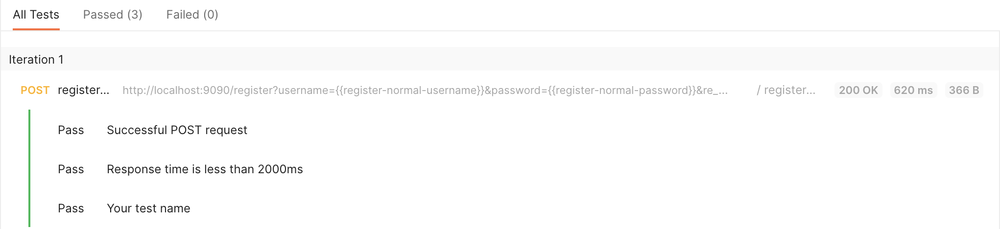

# 黑盒测试

## 目录

- [目录](#目录)
- [流程](#流程)
- [改动](#改动)

## 流程

1. 打开 MySQL 命令行

```bash
$ ../../../../usr/local/mysql/bin/mysql -uroot -pxhd200176
```

2. 删除并重新建数据库 `e_book`。

```SQL
drop database e_book;
create database e_book;
use e_book
$$
```

3. 执行脚本命令插入三个用户和 1000 本书籍。

```SQL
delimiter $$
drop procedure if exists myproc4;
create procedure myproc4 ()
begin
# 插入 1000 条书籍数据
declare num int ;
set num = 1 ;
while num <= 1000 do
insert into book(id, author, bookname, image, introduction, inventory, isbn, price, state, type) values (num, 'xuhuidong', 'Algorithm', 'img url', 'This is for test.', 2000, '123-321-123-321', 99, 1, 'Computer Science');
set num = num + 1 ; 
end while;
# 插入唯一的 Admin 和 一个正常用户 和 一个被禁用户
insert into user(id, username, password, email, role, state) values (1, 'Admin', 'Password1234', 'Admin@126.com', 'ADMIN', 'Normal');
insert into user(id, username, password, email, role, state) values (2, 'Customer', 'customer1234', 'Customer@126.com', 'USER', 'Normal');
insert into user(id, username, password, email, role, state) values (3, 'Forbidden@126.com', 'customer1234', 'Forbidden', 'USER', 'Forbidden');
end$$
call myproc4()$$
```

4. 运行后端代码。
5. 使用 `postman` 进行测试。

## 测试

### 注册正常

编写测试代码。

```javascript
// 获取请求中的参数
var query = {};
pm.request.url.query.all().forEach((param) => { query[param.key] = param.value});
// 测试请求返回码是否正常
pm.test("Successful POST request", function () {
    pm.expect(pm.response.code).to.be.eql(200);
});
// 测试返回时间是否符合标准
pm.test("Response time is less than 2000ms", function () {
    pm.expect(pm.response.responseTime).to.be.below(2000);
});
// 测试返回值是否正确
pm.test("Your test name", function () {
    var jsonData = pm.response.json();
    pm.expect(jsonData.username).to.eql(query.username);
    pm.expect(jsonData.password).to.eql(query.password);
    pm.expect(jsonData.email).to.eql(query.email);
});
```

测试通过。



检查数据库，用户注册成功。


### 注册异常

编写测试代码。

```javascript
// 测试请求返回码是否正常
pm.test("Successful POST request", function () {
    pm.expect(pm.response.code).to.be.oneOf([406, 500]);
});
// 测试返回时间是否符合标准
pm.test("Response time is less than 2000ms", function () {
    pm.expect(pm.response.responseTime).to.be.below(2000);
});
```

测试通过。


### 登录正常

编写测试代码。

```javascript
// 获取请求中的参数
var query = {};
pm.request.url.query.all().forEach((param) => { query[param.key] = param.value});
// 测试请求返回码是否正常
pm.test("Successful GET request", function () {
    pm.expect(pm.response.code).to.be.eql(200);
});
// 测试返回时间是否符合标准
pm.test("Response time is less than 2000ms", function () {
    pm.expect(pm.response.responseTime).to.be.below(2000);
});
// 测试返回值是否正确
pm.test("Your test name", function () {
    var jsonData = pm.response.json();
    pm.expect(jsonData.username).to.eql(query.username);
    pm.expect(jsonData.password).to.eql(query.password);
});
```

测试通过。


### 登录异常

编写测试代码。

```javascript
// 测试请求返回码是否正常
pm.test("Successful GET request", function () {
    pm.expect(pm.response.code).to.be.oneOf([404, 406, 500]);
});
// 测试返回时间是否符合标准
pm.test("Response time is less than 2000ms", function () {
    pm.expect(pm.response.responseTime).to.be.below(2000);
});
```

测试通过。


### 下订单正常

编写测试代码。

```javascript
// 测试请求返回码是否正常
pm.test("Successful POST request", function () {
    pm.expect(pm.response.code).to.be.eql(200);
});
// 测试返回时间是否符合标准
pm.test("Response time is less than 2000ms", function () {
    pm.expect(pm.response.responseTime).to.be.below(2000);
});
```

测试通过。


检查数据库下订单成功。


### 下订单异常

编写测试代码。

```javascript
// 测试请求返回码是否正常
pm.test("Successful POST request", function () {
    pm.expect(pm.response.code).to.be.oneOf([406, 500]);
});
// 测试返回时间是否符合标准
pm.test("Response time is less than 2000ms", function () {
    pm.expect(pm.response.responseTime).to.be.below(2000);
});
```

测试通过。


### 订单筛选正常

编写测试代码。

```javascript
// 获取请求中的参数
var query = {};
pm.request.url.query.all().forEach((param) => { query[param.key] = param.value});
// 测试请求返回码是否正常
pm.test("Successful GET request", function () {
    pm.expect(pm.response.code).to.be.eql(200);
});
// 测试返回时间是否符合标准
pm.test("Response time is less than 2000ms", function () {
    pm.expect(pm.response.responseTime).to.be.below(2000);
});
// 测试返回值是否正确
pm.test("Your test name", function () {
    var jsonData = pm.response.json();
    
    jsonData.forEach((order) => {
        console.log(order.timestamp.substring(0, 10));
        console.log(query.startdate);
        pm.expect(Date.parse(query.startdate)).to.be.below(Date.parse(order.timestamp.substring(0, 10)));
        pm.expect(Date.parse(order.timestamp.substring(0, 10))).to.be.below(Date.parse(query.enddate));
    });
    // for (const orderItem of jsonData.orderItems) {
    //     pm.expect(orderItem.order).to.be.below(200);
    // };
});
```

测试通过。


### 订单筛选异常

编写测试代码。

```javascript
// 测试请求返回码是否正常
pm.test("Successful GET request", function () {
    pm.expect(pm.response.code).to.be.oneOf([406, 500]);
});
// 测试返回时间是否符合标准
pm.test("Response time is less than 2000ms", function () {
    pm.expect(pm.response.responseTime).to.be.below(2000);
});
```

测试通过。


### 用户管理正常

编写测试代码。

```javascript
// 获取请求中的参数
var query = {};
pm.request.url.query.all().forEach((param) => { query[param.key] = param.value});
// 测试请求返回码是否正常
pm.test("Successful POST request", function () {
    pm.expect(pm.response.code).to.be.eql(200);
});
// 测试返回时间是否符合标准
pm.test("Response time is less than 2000ms", function () {
    pm.expect(pm.response.responseTime).to.be.below(2000);
});
// 测试返回值是否正确
pm.test("Your test name", function () {
    var jsonData = pm.response.json();
    pm.expect(jsonData).to.be.oneOf([0, 1]);
});
```

测试通过。


### 管理员统计销量

和订单过滤功能是一致的，也是先取出所有用户的订单，然后前端做统计，所以其实测试了订单过滤就相当于测试了统计销量。

## 改动

1. 注册正常的用户名改为 `ebook-normal`，防止与注册异常的用户名相冲突。
2. 下订单的时间需要改动，改成今天左右的时间。
